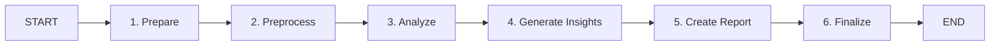
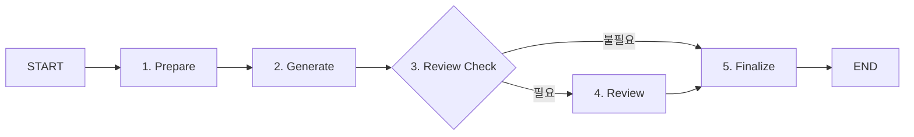

# Execution Agents 가이드

**버전**: 1.0
**작성일**: 2025-10-14
**아키텍처**: LangGraph 0.6+ Multi-Agent System

---

## 📚 목차

- [개요](#-개요)
- [Execution Agents 역할](#-execution-agents-역할)
- [전체 Agent 구성도](#-전체-agent-구성도)
- [Agent 간 State/Context 전달](#-agent-간-statecontext-전달)
- [3개 Execution Agents](#-3개-execution-agents)
- [워크플로우 패턴](#-워크플로우-패턴)
- [상태 관리](#-상태-관리)
- [Tool 선택 메커니즘](#-tool-선택-메커니즘)
- [에러 처리](#-에러-처리)
- [개발 가이드](#-개발-가이드)

---

## 🎯 개요

### Execution Agents란?

Execution Agents는 **고수준 계획(Planning)과 저수준 도구 실행(Tools) 사이의 중요한 브릿지 역할**을 수행합니다.

```
PlanningAgent: "무엇을(WHAT) 해야 하는가?" → 계획 수립
     ↓
Execution Agents: "어떻게(HOW) 실행할 것인가?" → 실행 오케스트레이션
     ↓
Tools: "실제 작업 수행" → 기능 구현
```

### 핵심 특징

| 특징 | 설명 |
|------|------|
| **LangGraph StateGraph** | 각 Agent는 독립적인 서브그래프로 구성 |
| **LLM 기반 Tool 선택** | 동적으로 필요한 도구 선택 (LLM #4, #5, #6) |
| **병렬/순차 실행** | 전략에 따라 Task 실행 방식 결정 |
| **Progress Tracking** | 실시간 진행 상황 업데이트 (WebSocket) |
| **에러 복구** | 부분 실패 허용, 다른 작업 계속 진행 |

---

## 🔧 Execution Agents 역할

### 1. 복잡한 오케스트레이션 관리

- **다수 Tool 조합**: 5개 이상의 도구를 조건부로 선택하고 조합
- **병렬/순차 실행**: 실행 전략에 따라 최적 실행 방식 결정
- **조건부 Tool 선택**: 쿼리 내용에 따라 도구 동적 선택

### 2. 도메인 특화 비즈니스 로직 캡슐화

- **산업별 규칙 구현**: 부동산 전세금 5% 인상 제한 등
- **법규 준수 검증**: 자동으로 법률 위반 여부 확인
- **커스텀 분석 알고리즘**: 도메인 특화 계산 로직

### 3. 상태 관리와 워크플로우 구현

- **LangGraph StateGraph**: 복잡한 멀티스텝 워크플로우 관리
- **상태 추적**: 각 단계별 진행 상황 및 결과 추적
- **진행 상황 모니터링**: WebSocket을 통한 실시간 업데이트

---

## 🏗️ 전체 Agent 구성도

### Agent 계층 구조

시스템은 3계층 Agent 아키텍처로 구성되어 있습니다:

```
┌─────────────────────────────────────────────────────────────┐
│                   TeamBasedSupervisor                        │
│  - 최상위 오케스트레이터                                        │
│  - 전체 워크플로우 관리                                         │
│  - Long-term Memory 로딩/저장                                 │
│  - WebSocket 진행 상황 전송                                    │
└───────────────────┬─────────────────────────────────────────┘
                    │
                    ├───> PlanningAgent (Cognitive Layer)
                    │     - 의도 분석 (LLM #1 - intent_analysis)
                    │     - Agent 선택 (LLM #2, #3 - agent_selection)
                    │     - 실행 계획 생성
                    │     - QueryDecomposer 통합 (복합 질문 분해)
                    │
                    ├───> SearchExecutor (Execution Layer)
                    │     ├─> HybridLegalSearch (Tool)
                    │     ├─> MarketDataTool (Tool)
                    │     ├─> RealEstateSearchTool (Tool)
                    │     └─> LoanDataTool (Tool)
                    │
                    ├───> AnalysisExecutor (Execution Layer)
                    │     ├─> ContractAnalysisTool (Tool)
                    │     ├─> MarketAnalysisTool (Tool)
                    │     ├─> ROICalculatorTool (Tool)
                    │     ├─> LoanSimulatorTool (Tool)
                    │     └─> PolicyMatcherTool (Tool)
                    │
                    └───> DocumentExecutor (Execution Layer)
                          └─> LeaseContractGeneratorTool (Tool)
```

### Agent 목록 및 연결된 Tool

| Agent 이름 | 계층 | 연결된 Tool | Tool 개수 |
|-----------|-----|-----------|----------|
| **TeamBasedSupervisor** | Supervisor | PlanningAgent, SearchExecutor, AnalysisExecutor, DocumentExecutor | 4 agents |
| **PlanningAgent** | Cognitive | LLMService, QueryDecomposer | 2 services |
| **SearchExecutor** | Execution | HybridLegalSearch, MarketDataTool, RealEstateSearchTool, LoanDataTool | 4 tools |
| **AnalysisExecutor** | Execution | ContractAnalysisTool, MarketAnalysisTool, ROICalculatorTool, LoanSimulatorTool, PolicyMatcherTool | 5 tools |
| **DocumentExecutor** | Execution | LeaseContractGeneratorTool | 1 tool |
| **총 Tool 수** | - | - | **11 tools** |

### Agent 역할 매트릭스

| Agent | 검색 | 분석 | 문서생성 | 의도분석 | 계획수립 | 오케스트레이션 |
|-------|-----|------|---------|---------|---------|--------------|
| TeamBasedSupervisor | - | - | - | - | - | ✅ |
| PlanningAgent | - | - | - | ✅ | ✅ | - |
| SearchExecutor | ✅ | - | - | - | - | - |
| AnalysisExecutor | - | ✅ | - | - | - | - |
| DocumentExecutor | - | - | ✅ | - | - | - |

---

## 🔄 Agent 간 State/Context 전달

### State 전달 흐름도

```mermaid
sequenceDiagram
    participant User
    participant TeamSupervisor
    participant Planning
    participant SearchExec
    participant AnalysisExec
    participant DocumentExec

    User->>TeamSupervisor: 사용자 쿼리 + session_id + user_id

    Note over TeamSupervisor: MainSupervisorState 초기화

    TeamSupervisor->>TeamSupervisor: initialize_node()
    Note right of TeamSupervisor: start_time, status 설정

    TeamSupervisor->>Planning: planning_node()
    Note over Planning: PlanningState 생성
    Planning->>Planning: analyze_intent(query)
    Note right of Planning: LLM #1, #2, #3 호출
    Planning->>Planning: create_execution_plan()
    Planning-->>TeamSupervisor: PlanningState (execution_steps)

    Note over TeamSupervisor: SharedState 생성

    TeamSupervisor->>SearchExec: execute(SharedState)
    Note over SearchExec: SearchTeamState 생성
    SearchExec->>SearchExec: LLM #5 Tool 선택
    SearchExec->>SearchExec: 4개 Tool 실행
    SearchExec-->>TeamSupervisor: SearchTeamState (results)

    Note over TeamSupervisor: team_results["search"] 저장

    TeamSupervisor->>AnalysisExec: execute(SharedState, input_data)
    Note over AnalysisExec: AnalysisTeamState 생성<br/>input_data = SearchTeam 결과
    AnalysisExec->>AnalysisExec: LLM #6 Tool 선택
    AnalysisExec->>AnalysisExec: 5개 Tool 실행
    AnalysisExec->>AnalysisExec: LLM #8, #9 인사이트 생성
    AnalysisExec-->>TeamSupervisor: AnalysisTeamState (report)

    TeamSupervisor->>DocumentExec: execute(SharedState, doc_type)
    Note over DocumentExec: DocumentTeamState 생성
    DocumentExec->>DocumentExec: 문서 생성
    DocumentExec-->>TeamSupervisor: DocumentTeamState (document)

    TeamSupervisor->>TeamSupervisor: aggregate_results_node()
    Note right of TeamSupervisor: 모든 팀 결과 집계

    TeamSupervisor->>TeamSupervisor: generate_response_node()
    Note right of TeamSupervisor: LLM #10 최종 응답 생성<br/>Long-term Memory 저장

    TeamSupervisor-->>User: final_response
```



### 1. MainSupervisorState (최상위 State)

**파일**: [team_supervisor.py:286-347](../service_agent/supervisor/team_supervisor.py#L286-L347)

```python
class MainSupervisorState(TypedDict, total=False):
    """
    TeamBasedSupervisor의 최상위 State
    모든 하위 Agent의 결과를 통합 관리
    """
    # === 필수 필드 ===
    query: str                              # 사용자 쿼리
    session_id: str                         # 세션 ID
    request_id: str                         # 요청 ID
    user_id: Optional[int]                  # 사용자 ID (Long-term Memory용)

    # === Planning 관련 ===
    planning_state: Optional[PlanningState]  # 계획 수립 결과
    execution_plan: Optional[Dict]           # 실행 계획

    # === 팀별 State ===
    search_team_state: Optional[Dict]        # SearchExecutor 결과
    document_team_state: Optional[Dict]      # DocumentExecutor 결과
    analysis_team_state: Optional[Dict]      # AnalysisExecutor 결과

    # === 실행 추적 ===
    current_phase: str                       # "planning" | "executing" | "aggregation" | "response_generation"
    active_teams: List[str]                  # ["search", "analysis"]
    completed_teams: List[str]               # ["search"]
    failed_teams: List[str]                  # []

    # === 결과 집계 ===
    team_results: Dict[str, Any]             # 팀별 결과 저장
    aggregated_results: Dict[str, Any]       # 집계된 최종 결과
    final_response: Optional[Dict]           # 최종 응답

    # === 타이밍 ===
    start_time: Optional[datetime]
    end_time: Optional[datetime]
    total_execution_time: Optional[float]

    # === Long-term Memory ===
    loaded_memories: Optional[List[Dict]]    # 로드된 대화 기록
    user_preferences: Optional[Dict]         # 사용자 선호도
    memory_load_time: Optional[str]

    # === 에러 처리 ===
    error_log: List[str]
    status: str                              # "initialized" | "completed" | "error"
```

**주요 특징**:
- `total=False`: 모든 필드가 선택적 (Optional)
- Planning, Execution, Aggregation 단계별 State 저장
- 팀 간 데이터 전달을 위한 `team_results` 활용

### 2. PlanningState (계획 단계 State)

**파일**: [separated_states.py:271-284](../service_agent/foundation/separated_states.py#L271-L284)

```python
class PlanningState(TypedDict):
    """
    PlanningAgent가 생성하는 State
    의도 분석 결과와 실행 계획 포함
    """
    raw_query: str                           # 원본 쿼리
    analyzed_intent: Dict[str, Any]          # 의도 분석 결과
    intent_confidence: float                 # 신뢰도 (0.0 ~ 1.0)
    available_agents: List[str]              # 사용 가능한 Agent 목록
    available_teams: List[str]               # 사용 가능한 팀 목록 ["search", "analysis", "document"]
    execution_steps: List[ExecutionStepState] # 실행 단계 목록 (TODO 아이템)
    execution_strategy: str                  # "sequential" | "parallel" | "pipeline"
    parallel_groups: Optional[List[List[str]]] # 병렬 실행 그룹
    plan_validated: bool                     # 계획 검증 여부
    validation_errors: List[str]             # 검증 오류
    estimated_total_time: float              # 예상 실행 시간 (초)
```

**전달 경로**:
```python
# TeamSupervisor.planning_node() → MainSupervisorState
state["planning_state"] = planning_state
```

### 3. SharedState (공유 State)

**파일**: [separated_states.py:59-72](../service_agent/foundation/separated_states.py#L59-L72)

```python
class SharedState(TypedDict):
    """
    모든 Execution Agent가 공유하는 최소 State
    팀 간 통신의 기본 단위
    """
    user_query: str                          # 사용자 쿼리
    session_id: str                          # 세션 ID
    user_id: Optional[int]                   # 사용자 ID
    timestamp: str                           # 타임스탬프 (ISO format)
    language: str                            # 언어 ("ko")
    status: Literal["pending", "processing", "completed", "error"]
    error_message: Optional[str]
```

**생성 위치**:
```python
# TeamSupervisor.execute_teams_node()
shared_state = StateManager.create_shared_state(
    query=state["query"],
    session_id=state["session_id"],
    user_id=state.get("user_id")
)
```

**전달 대상**:
- SearchExecutor
- AnalysisExecutor
- DocumentExecutor

### 4. SearchTeamState (검색팀 State)

**파일**: [separated_states.py:77-110](../service_agent/foundation/separated_states.py#L77-L110)

```python
class SearchTeamState(TypedDict):
    """SearchExecutor 전용 State"""
    team_name: str                           # "search"
    status: str                              # "pending" | "in_progress" | "completed" | "failed"
    shared_context: Dict[str, Any]           # SharedState 포함

    # 검색 입력
    keywords: Optional[SearchKeywords]       # 추출된 키워드
    search_scope: List[str]                  # ["legal", "real_estate", "loan"]
    filters: Dict[str, Any]                  # 필터 조건

    # 검색 결과
    legal_results: List[Dict[str, Any]]      # 법률 검색 결과
    real_estate_results: List[Dict[str, Any]] # 시세 검색 결과
    property_search_results: List[Dict[str, Any]] # 매물 검색 결과
    loan_results: List[Dict[str, Any]]       # 대출 검색 결과
    aggregated_results: Dict[str, Any]       # 집계 결과

    # 메타데이터
    total_results: int                       # 총 결과 수
    search_time: float                       # 검색 소요 시간
    sources_used: List[str]                  # 사용된 데이터 소스
    search_progress: Dict[str, str]          # 진행 상황

    # 타이밍
    start_time: Optional[datetime]
    end_time: Optional[datetime]
    error: Optional[str]
```

**반환 후 처리**:
```python
# TeamSupervisor._execute_single_team()
result = await team.execute(shared_state)

# 결과 저장 (다음 팀을 위해)
state["team_results"]["search"] = self._extract_team_data(result, "search")
# → {"legal_search": [...], "real_estate_search": [...], "loan_search": [...]}
```

### 5. AnalysisTeamState (분석팀 State)

**파일**: [separated_states.py:202-234](../service_agent/foundation/separated_states.py#L202-L234)

```python
class AnalysisTeamState(TypedDict):
    """AnalysisExecutor 전용 State"""
    team_name: str                           # "analysis"
    status: str
    shared_context: Dict[str, Any]           # SharedState 포함

    # 분석 입력
    analysis_type: str                       # "comprehensive" | "market" | "risk" | "contract"
    input_data: Dict[str, Any]               # 입력 데이터 (SearchTeam 결과 포함)

    # 분석 결과
    raw_analysis: Dict[str, Any]             # 원시 분석 결과 (tool별)
    metrics: Dict[str, float]                # 계산된 지표
    insights: List[str]                      # 인사이트
    report: Dict[str, Any]                   # 분석 보고서
    visualization_data: Optional[Dict]       # 시각화 데이터
    recommendations: List[str]               # 추천사항
    confidence_score: float                  # 분석 신뢰도

    # 메타데이터
    analysis_progress: Dict[str, str]
    start_time: Optional[datetime]
    end_time: Optional[datetime]
    analysis_time: Optional[float]
    error: Optional[str]
```

**입력 데이터 전달**:
```python
# TeamSupervisor._execute_single_team()
if team_name == "analysis":
    # SearchTeam 결과를 AnalysisTeam에 전달
    input_data = main_state.get("team_results", {})
    return await team.execute(
        shared_state,
        analysis_type="comprehensive",
        input_data=input_data  # ← SearchTeam 결과 전달
    )
```

### 6. DocumentTeamState (문서팀 State)

**파일**: [separated_states.py:137-165](../service_agent/foundation/separated_states.py#L137-L165)

```python
class DocumentTeamState(TypedDict):
    """DocumentExecutor 전용 State"""
    team_name: str                           # "document"
    status: str
    shared_context: Dict[str, Any]           # SharedState 포함

    # 문서 입력
    document_type: str                       # "lease_contract" | "sales_contract"
    template: Optional[DocumentTemplate]     # 선택된 템플릿
    document_content: Optional[DocumentContent] # 문서 내용
    generation_progress: Dict[str, str]      # 생성 진행 상황

    # 검토 관련
    review_needed: bool                      # 검토 필요 여부
    review_result: Optional[ReviewResult]    # 검토 결과
    final_document: Optional[str]            # 최종 문서 (Markdown)

    # 타이밍
    start_time: Optional[datetime]
    end_time: Optional[datetime]
    generation_time: Optional[float]
    review_time: Optional[float]
    error: Optional[str]
```

### State 전달 요약표

| 단계 | 생성 위치 | State 타입 | 전달 대상 | 전달 데이터 |
|-----|---------|-----------|---------|----------|
| 1. 초기화 | `TeamSupervisor.initialize_node()` | `MainSupervisorState` | - | query, session_id, user_id |
| 2. 계획 | `TeamSupervisor.planning_node()` | `PlanningState` | MainSupervisorState | analyzed_intent, execution_steps |
| 3. 공유 상태 생성 | `TeamSupervisor.execute_teams_node()` | `SharedState` | Execution Agents | query, session_id, user_id |
| 4. 검색 실행 | `SearchExecutor.execute()` | `SearchTeamState` | MainSupervisorState | legal_results, real_estate_results, loan_results |
| 5. 분석 실행 | `AnalysisExecutor.execute()` | `AnalysisTeamState` | MainSupervisorState | insights, report, recommendations |
| 6. 문서 실행 | `DocumentExecutor.execute()` | `DocumentTeamState` | MainSupervisorState | generated_document, review_result |
| 7. 결과 집계 | `TeamSupervisor.aggregate_results_node()` | `MainSupervisorState.aggregated_results` | - | 모든 팀 결과 통합 |
| 8. 응답 생성 | `TeamSupervisor.generate_response_node()` | `MainSupervisorState.final_response` | User | 최종 응답 (LLM #10 생성) |

### Context 전달 메커니즘

#### 1. 팀 간 순차 데이터 전달 (SearchTeam → AnalysisTeam)

```python
# TeamSupervisor._execute_teams_sequential()
for team_name in teams:
    result = await self._execute_single_team(team_name, shared_state, main_state)

    # SearchTeam 완료 후 AnalysisTeam에 데이터 전달
    if team_name == "search" and "analysis" in teams:
        main_state["team_results"][team_name] = self._extract_team_data(result, team_name)
        # → AnalysisTeam이 main_state["team_results"]["search"]를 input_data로 받음
```

#### 2. StateManager를 통한 State 병합

**파일**: [separated_states.py:454-498](../service_agent/foundation/separated_states.py#L454-L498)

```python
@staticmethod
def merge_team_results(
    main_state: MainSupervisorState,
    team_name: str,
    team_result: Dict[str, Any]
) -> MainSupervisorState:
    """
    팀 결과를 MainSupervisorState에 병합
    """
    # 팀 결과 저장
    main_state["team_results"][team_name] = team_result

    # 완료/실패 팀 목록 업데이트
    if team_result.get("status") in ["completed", "success"]:
        main_state["completed_teams"].append(team_name)
    else:
        main_state["failed_teams"].append(team_name)

    # active_teams에서 제거
    if team_name in main_state["active_teams"]:
        main_state["active_teams"].remove(team_name)

    return main_state
```

#### 3. ExecutionStepState를 통한 진행 상황 추적

**파일**: [separated_states.py:239-269](../service_agent/foundation/separated_states.py#L239-L269)

```python
class ExecutionStepState(TypedDict):
    """
    execution_steps의 표준 형식
    WebSocket을 통해 Frontend에 실시간 전송
    """
    # 식별 정보
    step_id: str                    # "step_0", "step_1"
    step_type: str                  # "search" | "analysis" | "document"
    agent_name: str                 # "search_team"
    team: str                       # "search"

    # 작업 정보
    task: str                       # "법률 정보 검색"
    description: str                # "법률 관련 정보 및 판례 검색"

    # 상태 추적
    status: Literal["pending", "in_progress", "completed", "failed", "skipped"]
    progress_percentage: int        # 0-100

    # 타이밍
    started_at: Optional[str]       # ISO format datetime
    completed_at: Optional[str]

    # 결과/에러
    result: Optional[Dict]          # 실행 결과
    error: Optional[str]            # 에러 메시지
```

**업데이트 예시**:
```python
# TeamSupervisor._execute_teams_sequential()
# 실행 전: status = "in_progress"
planning_state = StateManager.update_step_status(
    planning_state,
    step_id="step_0",
    "in_progress",
    progress=0
)

# 실행 후: status = "completed"
planning_state = StateManager.update_step_status(
    planning_state,
    step_id="step_0",
    "completed",
    progress=100
)

# WebSocket으로 Frontend에 실시간 전송
await progress_callback("todo_updated", {
    "execution_steps": planning_state["execution_steps"]
})
```

---

## ⚙️ 3개 Execution Agents

### 1. SearchExecutor - 검색 실행 Agent

**파일 위치**: [search_executor.py](../service_agent/execution_agents/search_executor.py)

#### 주요 기능

```python
class SearchExecutor:
    """
    법률, 부동산, 대출 검색 작업을 실행
    """

    def __init__(self, llm_context=None):
        # 4개 검색 도구 초기화
        self.legal_search_tool = HybridLegalSearch()         # 법률 검색
        self.market_data_tool = MarketDataTool()             # 시세 조회
        self.real_estate_search_tool = RealEstateSearchTool() # 매물 검색
        self.loan_data_tool = LoanDataTool()                 # 대출 정보
```

#### 워크플로우 (5단계)


**각 노드 설명**:

1. **prepare_search_node**: 키워드 추출 및 검색 범위 설정
   - LLM 기반 키워드 추출 (LLM #4 - keyword_extraction)
   - Fallback: 패턴 매칭 기반 키워드 추출

2. **route_search_node**: 병렬/순차 실행 결정
   - 2개 이상 → parallel
   - 1개 → sequential

3. **execute_search_node**: 실제 검색 실행
   - **LLM 기반 Tool 선택** (LLM #5 - tool_selection_search)
   - 4개 검색 도구 중 필요한 것만 선택 실행
   - Decision Logger에 기록

4. **aggregate_results_node**: 결과 집계
   - 여러 검색 결과 통합
   - 통계 정보 생성

5. **finalize_node**: 최종화
   - 상태 정리
   - 검색 시간 계산

#### LLM Tool 선택 예시

```python
async def _select_tools_with_llm(self, query: str) -> Dict[str, Any]:
    """LLM을 사용한 tool 선택"""
    result = await self.llm_service.complete_json_async(
        prompt_name="tool_selection_search",  # LLM #5
        variables={
            "query": query,
            "available_tools": json.dumps(self._get_available_tools())
        },
        temperature=0.1
    )

    return {
        "selected_tools": result.get("selected_tools", []),  # ["legal_search", "market_data"]
        "reasoning": result.get("reasoning", ""),
        "confidence": result.get("confidence", 0.0)
    }
```

#### 검색 결과 구조

```python
SearchTeamState = {
    "legal_results": [
        {
            "law_title": "주택임대차보호법",
            "article_number": "제7조의2",
            "content": "...",
            "relevance_score": 0.95
        }
    ],
    "real_estate_results": [...],  # 시세 정보
    "property_search_results": [...],  # 개별 매물
    "loan_results": [...],  # 대출 상품
    "total_results": 42,
    "search_time": 2.5
}
```

---

### 2. AnalysisExecutor - 분석 실행 Agent

**파일 위치**: [analysis_executor.py](../service_agent/execution_agents/analysis_executor.py)

#### 주요 기능

```python
class AnalysisExecutor:
    """
    데이터 분석 및 인사이트 생성 작업을 실행
    """

    def __init__(self, llm_context=None):
        # 5개 분석 도구 초기화
        self.contract_tool = ContractAnalysisTool()     # 계약서 분석
        self.market_tool = MarketAnalysisTool()         # 시장 분석
        self.roi_tool = ROICalculatorTool()             # 투자수익률
        self.loan_tool = LoanSimulatorTool()            # 대출 시뮬레이션
        self.policy_tool = PolicyMatcherTool()          # 정책 매칭
```

#### 워크플로우 (6단계)



**각 노드 설명**:

1. **prepare_analysis_node**: 분석 준비
   - 분석 타입 결정 (comprehensive/market/risk 등)

2. **preprocess_data_node**: 데이터 전처리
   - 입력 데이터 정제 및 변환

3. **analyze_data_node**: 실제 분석 수행
   - **LLM 기반 Tool 선택** (LLM #6 - tool_selection_analysis)
   - 선택된 도구 실행 (병렬)
   - 커스텀 분석 (전세금 인상률 계산 등)

4. **generate_insights_node**: 인사이트 생성
   - **LLM 기반 인사이트** (LLM #8, #9 - insight_generation)
   - 신뢰도 계산

5. **create_report_node**: 보고서 작성
   - 요약, 주요 발견사항, 추천사항 정리

6. **finalize_node**: 최종화

#### 커스텀 분석 예시 (전세금 인상률)

```python
def _perform_custom_analysis(self, query: str, data: Dict) -> Dict:
    """쿼리 기반 맞춤 분석"""
    # 전세금 인상 관련 쿼리 감지
    if "전세금" in query and any(x in query for x in ["올", "인상", "올려"]):
        amounts = re.findall(r'(\d+)억', query)  # "3억을 10억으로"

        if len(amounts) >= 2:
            old_amount = float(amounts[0])
            new_amount = float(amounts[1])
            increase_rate = ((new_amount - old_amount) / old_amount) * 100

            return {
                "type": "rent_increase_analysis",
                "increase_rate": f"{increase_rate:.1f}%",
                "legal_limit": "5%",
                "is_legal": increase_rate <= 5,
                "assessment": f"요청된 인상률 {increase_rate:.1f}%는 법정 한도 5%를 {'초과' if increase_rate > 5 else '준수'}합니다.",
                "recommendation": "법정 한도를 초과하는 인상은 거부할 수 있습니다." if increase_rate > 5 else "법정 범위 내 인상입니다."
            }
```

#### 분석 결과 구조

```python
AnalysisTeamState = {
    "raw_analysis": {
        "market": {...},      # 시장 분석 결과
        "contract": {...},    # 계약서 분석 결과
        "roi": {...},         # ROI 계산 결과
        "loan": {...},        # 대출 시뮬레이션 결과
        "custom": {...}       # 커스텀 분석 결과
    },
    "insights": [
        {
            "insight_type": "rent_increase",
            "content": "요청된 인상률 10.0%는 법정 한도 5%를 초과합니다.",
            "confidence": 0.95,
            "supporting_data": {...}
        }
    ],
    "report": {
        "title": "종합 분석 보고서",
        "summary": "...",
        "key_findings": [...],
        "recommendations": [...]
    },
    "confidence_score": 0.85
}
```

---

### 3. DocumentExecutor - 문서 생성 Agent

**파일 위치**: [document_executor.py](../service_agent/execution_agents/document_executor.py)

#### 주요 기능

```python
class DocumentExecutor:
    """
    문서 생성 및 검토 파이프라인 실행
    """

    def __init__(self, llm_context=None):
        # 문서 템플릿 로드
        self.templates = {
            "lease_contract": DocumentTemplate(...),      # 주택임대차계약서
            "sales_contract": DocumentTemplate(...),      # 부동산매매계약서
            "loan_application": DocumentTemplate(...)     # 대출신청서
        }

        # 문서 생성 Tool
        self.tools = {
            "lease_contract_generator": LeaseContractGeneratorTool()
        }
```

#### 워크플로우 (5단계)



**각 노드 설명**:

1. **prepare_document_node**: 문서 준비
   - 템플릿 선택
   - 파라미터 검증

2. **generate_document_node**: 문서 생성
   - Tool 사용 (LeaseContractGeneratorTool)
   - DocumentAgent 호출 (Fallback)

3. **review_check_node**: 검토 필요 여부 확인

4. **review_document_node**: 문서 검토
   - ReviewAgent 호출
   - 위험 요소 탐지
   - 법적 준수 확인

5. **finalize_node**: 최종화
   - 최종 문서 포맷팅 (Markdown)
   - 메타데이터 정리

#### 문서 생성 예시

```python
async def generate_document_node(self, state: DocumentTeamState):
    """문서 생성 노드"""
    doc_type = state.get("document_type", "lease_contract")

    # Tool 사용
    if doc_type == "lease_contract" and "lease_contract_generator" in self.tools:
        tool = self.tools["lease_contract_generator"]
        params = state.get("document_params", {})

        result = await tool.execute(**params)

        if result.get("status") == "success":
            state["generated_document"] = DocumentContent(
                title=result.get("title", "주택임대차 표준계약서"),
                sections=result.get("sections", []),
                metadata=result.get("metadata", {}),
                generated_at=datetime.now()
            )
```

#### 문서 결과 구조

```python
DocumentTeamState = {
    "document_type": "lease_contract",
    "template": {
        "template_id": "lease_001",
        "template_name": "주택임대차계약서",
        "required_fields": ["lessor", "lessee", "deposit"]
    },
    "generated_document": {
        "title": "주택임대차 표준계약서",
        "sections": [
            {"title": "계약 당사자", "content": "..."},
            {"title": "목적물", "content": "..."}
        ]
    },
    "review_result": {
        "risk_level": "low",
        "risk_factors": [...],
        "recommendations": [...],
        "score": 0.85
    },
    "final_document": "# 주택임대차 표준계약서\n\n..."
}
```

---

## 🔄 워크플로우 패턴

### 패턴 1: 선형 파이프라인 (DocumentExecutor)

```python
workflow.add_edge(START, "prepare")
workflow.add_edge("prepare", "generate")
workflow.add_edge("generate", "review_check")
# 조건부 분기 없음, 순차 실행
```

**특징**:
- 단순한 흐름
- 각 단계가 순차적으로 실행
- 이전 단계 완료 필수

### 패턴 2: 조건부 라우팅 (SearchExecutor)

```python
workflow.add_conditional_edges(
    "route",
    self._route_decision,
    {
        "search": "search",
        "skip": "finalize"  # 검색 생략 가능
    }
)
```

**특징**:
- 동적 경로 결정
- 불필요한 단계 생략
- 효율성 향상

### 패턴 3: 병렬 실행 (AnalysisExecutor)

```python
# 5개 분석 도구를 병렬로 실행
tasks = []
if "market_analysis" in selected_tools:
    tasks.append(self.market_tool.execute(...))
if "contract_analysis" in selected_tools:
    tasks.append(self.contract_tool.execute(...))

# 동시 실행
results = await asyncio.gather(*tasks, return_exceptions=True)
```

**특징**:
- 독립적인 작업 동시 실행
- 응답 시간 단축
- 부분 실패 허용

---

## 📊 상태 관리

### State 구조 (TypedDict)

각 Execution Agent는 자신만의 State를 정의합니다:

#### SearchTeamState

```python
class SearchTeamState(TypedDict):
    team_name: str                      # "search"
    status: str                         # "pending" | "in_progress" | "completed" | "failed"
    shared_context: SharedState         # 공유 컨텍스트
    keywords: SearchKeywords            # 추출된 키워드
    search_scope: List[str]             # ["legal", "real_estate", "loan"]
    legal_results: List[Dict]           # 법률 검색 결과
    real_estate_results: List[Dict]     # 시세 검색 결과
    property_search_results: List[Dict] # 매물 검색 결과
    loan_results: List[Dict]            # 대출 검색 결과
    total_results: int                  # 총 결과 수
    search_time: float                  # 검색 소요 시간
    error: Optional[str]                # 에러 메시지
```

#### AnalysisTeamState

```python
class AnalysisTeamState(TypedDict):
    team_name: str
    status: str
    shared_context: SharedState
    analysis_type: str                  # "comprehensive" | "market" | "risk" | "contract"
    input_data: List[AnalysisInput]     # 입력 데이터
    raw_analysis: Dict                  # 분석 결과
    insights: List[AnalysisInsight]     # 인사이트
    report: AnalysisReport              # 보고서
    confidence_score: float             # 신뢰도 점수
    analysis_time: Optional[float]      # 분석 소요 시간
    error: Optional[str]
```

#### DocumentTeamState

```python
class DocumentTeamState(TypedDict):
    team_name: str
    status: str
    shared_context: SharedState
    document_type: str                  # "lease_contract" | "sales_contract" | "loan_application"
    template: DocumentTemplate          # 선택된 템플릿
    generated_document: DocumentContent # 생성된 문서
    review_result: ReviewResult         # 검토 결과
    final_document: str                 # 최종 문서 (Markdown)
    document_metadata: Dict             # 메타데이터
    error: Optional[str]
```

### State 업데이트 패턴

```python
async def example_node(self, state: SearchTeamState) -> SearchTeamState:
    """노드에서 State 업데이트"""
    # 1. State 읽기
    query = state.get("shared_context", {}).get("query", "")

    # 2. 작업 수행
    results = await self.search_tool.search(query)

    # 3. State 업데이트
    state["legal_results"] = results
    state["total_results"] = len(results)
    state["status"] = "completed"

    # 4. 업데이트된 State 반환
    return state
```

---

## 🎛️ Tool 선택 메커니즘

### LLM 기반 동적 Tool 선택

모든 Execution Agent는 **LLM을 사용하여 필요한 도구를 동적으로 선택**합니다.

#### 1. 사용 가능한 Tool 정보 수집

```python
def _get_available_tools(self) -> Dict[str, Any]:
    """현재 사용 가능한 tool 정보를 동적으로 수집"""
    tools = {}

    if self.legal_search_tool:
        tools["legal_search"] = {
            "name": "legal_search",
            "description": "법률 정보 검색 (전세법, 임대차보호법 등)",
            "capabilities": ["전세금 인상률 조회", "임차인 권리 확인"],
            "available": True
        }

    # 실제 초기화된 tool만 반환
    return tools
```

#### 2. LLM에게 Tool 선택 요청

```python
result = await self.llm_service.complete_json_async(
    prompt_name="tool_selection_search",  # LLM #5
    variables={
        "query": "전세금 5% 인상 가능한가요?",
        "available_tools": json.dumps(available_tools, ensure_ascii=False)
    },
    temperature=0.1
)
```

**Prompt 예시** (`tool_selection_search.txt`):

```text
당신은 검색 도구 선택 전문가입니다.

사용자 쿼리: {query}

사용 가능한 도구:
{available_tools}

위 쿼리에 적합한 도구를 선택하세요.

JSON 형식으로 응답:
{
  "selected_tools": ["legal_search", "market_data"],
  "reasoning": "전세금 인상 관련 법률 조회가 필요하므로 legal_search를 선택했습니다.",
  "confidence": 0.9
}
```

#### 3. 선택된 Tool 실행

```python
selected_tools = result.get("selected_tools", [])  # ["legal_search", "market_data"]

if "legal_search" in selected_tools:
    legal_results = await self.legal_search_tool.search(query)

if "market_data" in selected_tools:
    market_results = await self.market_data_tool.search(query)
```

#### 4. Decision Logger에 기록

```python
decision_id = self.decision_logger.log_tool_decision(
    agent_type="search",
    query=query,
    available_tools=available_tools,
    selected_tools=selected_tools,
    reasoning=result.get("reasoning", ""),
    confidence=result.get("confidence", 0.0)
)

# 실행 결과 업데이트
self.decision_logger.update_tool_execution_results(
    decision_id=decision_id,
    execution_results={"legal_search": {"status": "success", "result_count": 10}},
    total_execution_time_ms=1500,
    success=True
)
```

### Fallback 메커니즘

LLM이 실패하면 **규칙 기반 Fallback**으로 전환:

```python
def _select_tools_with_fallback(self, query: str = "") -> Dict[str, Any]:
    """LLM 실패 시 fallback: 모든 도구 사용 (안전망)"""
    available_tools = self._get_available_tools()
    scope = list(available_tools.keys())

    return {
        "selected_tools": scope,  # 모든 도구 사용
        "reasoning": "Fallback: using all available tools for safety",
        "confidence": 0.3
    }
```

---

## ❌ 에러 처리

### 부분 실패 허용 (Graceful Degradation)

```python
# 법률 검색 실행
try:
    legal_results = await self.legal_search_tool.search(query)
    execution_results["legal_search"] = {"status": "success", "result_count": len(legal_results)}
except Exception as e:
    logger.error(f"Legal search failed: {e}")
    execution_results["legal_search"] = {"status": "error", "error": str(e)}
    # ❗ 실패해도 계속 진행
```

**특징**:
- 한 도구 실패 시 다른 도구는 계속 실행
- 최종 응답에서 사용 가능한 결과만 활용
- 에러는 로그에 기록

### 에러 로깅

```python
if state.get("error"):
    state["status"] = "failed"
    logger.error(f"[SearchTeam] Execution failed: {state['error']}")
else:
    state["status"] = "completed"
    logger.info(f"[SearchTeam] Completed with {state['total_results']} results")
```

---

## 💻 개발 가이드

### 새로운 Execution Agent 추가

#### 1. State 정의

```python
# separated_states.py
class MyTeamState(TypedDict):
    team_name: str
    status: str
    shared_context: SharedState
    # 필요한 필드 추가
    my_results: List[Dict]
    error: Optional[str]
```

#### 2. Executor 클래스 생성

```python
# my_executor.py
class MyExecutor:
    def __init__(self, llm_context=None):
        self.llm_context = llm_context
        self.team_name = "my_team"
        self.app = None
        self._build_subgraph()

    def _build_subgraph(self):
        workflow = StateGraph(MyTeamState)

        # 노드 추가
        workflow.add_node("prepare", self.prepare_node)
        workflow.add_node("execute", self.execute_node)
        workflow.add_node("finalize", self.finalize_node)

        # 엣지 구성
        workflow.add_edge(START, "prepare")
        workflow.add_edge("prepare", "execute")
        workflow.add_edge("execute", "finalize")
        workflow.add_edge("finalize", END)

        self.app = workflow.compile()

    async def prepare_node(self, state: MyTeamState) -> MyTeamState:
        state["status"] = "in_progress"
        return state

    async def execute_node(self, state: MyTeamState) -> MyTeamState:
        # 실제 작업 수행
        return state

    async def finalize_node(self, state: MyTeamState) -> MyTeamState:
        state["status"] = "completed"
        return state

    async def execute(self, shared_state: SharedState) -> MyTeamState:
        initial_state = MyTeamState(
            team_name=self.team_name,
            status="pending",
            shared_context=shared_state,
            my_results=[],
            error=None
        )

        return await self.app.ainvoke(initial_state)
```

#### 3. TeamSupervisor에 등록

```python
# team_supervisor.py
self.teams = {
    "search": SearchExecutor(llm_context=llm_context),
    "document": DocumentExecutor(llm_context=llm_context),
    "analysis": AnalysisExecutor(llm_context=llm_context),
    "my_team": MyExecutor(llm_context=llm_context)  # 추가
}
```

### 테스트 작성

```python
async def test_my_executor():
    from app.service_agent.foundation.separated_states import StateManager

    # Executor 초기화
    executor = MyExecutor()

    # 공유 상태 생성
    shared_state = StateManager.create_shared_state(
        query="테스트 쿼리",
        session_id="test_session"
    )

    # 실행
    result = await executor.execute(shared_state)

    # 검증
    assert result["status"] == "completed"
    assert len(result.get("my_results", [])) > 0

    print(f"✅ Test passed: {result['status']}")

import asyncio
asyncio.run(test_my_executor())
```

---

## 📚 참고 자료

### 관련 문서

- [TOOLS_REFERENCE.md](TOOLS_REFERENCE.md) - 사용 가능한 Tool 상세 명세
- [SYSTEM_FLOW_DIAGRAM.md](SYSTEM_FLOW_DIAGRAM.md) - LLM 호출 지점 (LLM #4, #5, #6)
- [ARCHITECTURE_OVERVIEW.md](ARCHITECTURE_OVERVIEW.md) - 전체 시스템 아키텍처

### 코드 위치

| 항목 | 파일 경로 |
|------|----------|
| SearchExecutor | [backend/app/service_agent/execution_agents/search_executor.py](../service_agent/execution_agents/search_executor.py) |
| AnalysisExecutor | [backend/app/service_agent/execution_agents/analysis_executor.py](../service_agent/execution_agents/analysis_executor.py) |
| DocumentExecutor | [backend/app/service_agent/execution_agents/document_executor.py](../service_agent/execution_agents/document_executor.py) |
| State 정의 | [backend/app/service_agent/foundation/separated_states.py](../service_agent/foundation/separated_states.py) |

---

**생성일**: 2025-10-14
**버전**: 1.0
**상태**: ✅ 프로덕션 준비 완료
