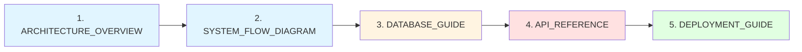

# 📚 홈즈냥즈 시스템 가이드

**부동산 AI 챗봇 "도와줘 홈즈냥즈" 기술 문서**

[](https://github.com/holmesnyangz/beta_v001)
[](https://www.langchain.com/langgraph)
[](https://www.postgresql.org/)
[]()

---

## 🎯 가이드 소개

이 폴더는 **홈즈냥즈 프로젝트의 모든 기술 문서**를 포함합니다. 신규 개발자 온보딩, API 개발, 시스템 배포 등 모든 단계에서 필요한 정보를 제공합니다.

### 📖 문서 목록

| 문서 | 페이지 | 코드 예시 | 다이어그램 | 설명 |
|------|--------|-----------|-----------|------|
| [ARCHITECTURE_OVERVIEW.md](ARCHITECTURE_OVERVIEW.md) | 15p | 10+ | ✅ Mermaid | 전체 아키텍처 개요 |
| [SYSTEM_FLOW_DIAGRAM.md](SYSTEM_FLOW_DIAGRAM.md) | 15p | 10+ | ✅ Mermaid | 시스템 흐름도 (LLM 호출) |
| [DATABASE_GUIDE.md](DATABASE_GUIDE.md) | 12p | 20+ | ✅ ERD | 데이터베이스 가이드 |
| [API_REFERENCE.md](API_REFERENCE.md) | 10p | 15+ | ❌ | API 레퍼런스 |
| [DEPLOYMENT_GUIDE.md](DEPLOYMENT_GUIDE.md) | 11p | 25+ | ✅ Mermaid | 배포 가이드 |

**총 문서량**: ~63 페이지 (A4 기준), 80+ 코드 예시

---

## 🗺️ 문서 활용 가이드

### 👨‍💻 **신규 개발자 온보딩 (추천 순서)**



#### **1단계: 아키텍처 이해 (1-2시간)**
📖 [ARCHITECTURE_OVERVIEW.md](ARCHITECTURE_OVERVIEW.md)
- 전체 시스템 구조 파악
- LangGraph 기반 Multi-Agent 시스템 이해
- 팀 기반 워크플로우 개념 학습

#### **2단계: 시스템 흐름 이해 (2-3시간)**
📖 [SYSTEM_FLOW_DIAGRAM.md](SYSTEM_FLOW_DIAGRAM.md)
- LLM 호출 지점 10회 전체 파악
- WebSocket 메시지 프로토콜 이해
- 3가지 시나리오 처리 흐름 학습
- 최적화 포인트 이해

#### **3단계: 데이터베이스 이해 (1-2시간)**
📖 [DATABASE_GUIDE.md](DATABASE_GUIDE.md)
- PostgreSQL 스키마 구조 파악
- 6개 주요 테이블 이해
- pgvector 벡터 검색 학습
- 쿼리 작성 실습

#### **4단계: API 사용법 학습 (1시간)**
📖 [API_REFERENCE.md](API_REFERENCE.md)
- HTTP REST API 6개 엔드포인트
- WebSocket 프로토콜 이해
- 예제 코드 실습 (Python, JavaScript, TypeScript)

#### **5단계: 배포 환경 이해 (30분)**
📖 [DEPLOYMENT_GUIDE.md](DEPLOYMENT_GUIDE.md)
- Docker/Kubernetes 배포 방법
- CI/CD 파이프라인 이해
- 모니터링 및 롤백 전략

---

### 🔌 **API 클라이언트 개발자**

#### **필수 읽기**
📖 [API_REFERENCE.md](API_REFERENCE.md)
- HTTP REST API 전체 명세
- WebSocket 메시지 프로토콜
- 예제 코드 (Python, JavaScript, TypeScript)

#### **참고 문서**
📖 [SYSTEM_FLOW_DIAGRAM.md](SYSTEM_FLOW_DIAGRAM.md)
- WebSocket 메시지 흐름
- Server → Client 메시지 타이밍

#### **Quick Start**
```javascript
// 1. 세션 생성
const session = await fetch("http://localhost:8000/api/v1/chat/start", {
  method: "POST",
  body: JSON.stringify({})
});
const { session_id } = await session.json();

// 2. WebSocket 연결
const ws = new WebSocket(`ws://localhost:8000/api/v1/chat/ws/${session_id}`);

ws.onmessage = (event) => {
  const data = JSON.parse(event.data);
  console.log(data.type, data);
};

// 3. 쿼리 전송
ws.send(JSON.stringify({
  type: "query",
  query: "전세금 5% 인상 가능한가요?"
}));
```

---

### 🗄️ **데이터베이스 관리자**

#### **필수 읽기**
📖 [DATABASE_GUIDE.md](DATABASE_GUIDE.md)
- PostgreSQL 15+ 스키마
- 6개 주요 테이블 (sessions, checkpoints, legal_clauses, properties, transactions, conversation_memories)
- 백업/복구 가이드
- 성능 최적화 (인덱스, 연결 풀)

#### **주요 작업**

##### **1. 데이터베이스 설치 (Docker)**
```bash
docker run -d \
  --name postgres-holmesnyangz \
  -e POSTGRES_PASSWORD=root1234 \
  -e POSTGRES_DB=real_estate \
  -p 5432:5432 \
  postgres:15

# pgvector 확장 설치
docker exec -it postgres-holmesnyangz psql -U postgres -d real_estate \
  -c "CREATE EXTENSION IF NOT EXISTS vector;"
```

##### **2. 백업**
```bash
pg_dump -U postgres -d real_estate > backup_$(date +%Y%m%d).sql
```

##### **3. 복구**
```bash
psql -U postgres -d real_estate < backup_20251014.sql
```

##### **4. 성능 모니터링**
```sql
-- 느린 쿼리 확인
SELECT * FROM pg_stat_statements
ORDER BY mean_exec_time DESC
LIMIT 10;

-- 인덱스 사용률
SELECT * FROM pg_stat_user_indexes
ORDER BY idx_scan DESC;
```

---

### ⚙️ **DevOps 엔지니어**

#### **필수 읽기**
📖 [DEPLOYMENT_GUIDE.md](DEPLOYMENT_GUIDE.md)
- Docker 배포 (Dockerfile, docker-compose.yml)
- Kubernetes 배포 (Deployment, Service, Ingress, HPA)
- CI/CD 파이프라인 (GitHub Actions)
- 모니터링 (Prometheus, Grafana, Sentry)

#### **참고 문서**
📖 [DATABASE_GUIDE.md](DATABASE_GUIDE.md)
- 데이터베이스 백업/복구
- 성능 최적화

📖 [SYSTEM_FLOW_DIAGRAM.md](SYSTEM_FLOW_DIAGRAM.md)
- 성능 최적화 포인트
- IRRELEVANT 조기 종료 (90% 응답 시간 단축)

#### **Quick Start (Docker)**
```bash
# 1. 환경 변수 설정
cp .env.example .env
# .env 파일 수정: OPENAI_API_KEY, DATABASE_URL

# 2. Docker Compose 실행
docker-compose up -d

# 3. 헬스 체크
curl http://localhost:8000/health
```

#### **Quick Start (Kubernetes)**
```bash
# 1. Namespace 생성
kubectl apply -f k8s/namespace.yaml

# 2. Secret 생성
kubectl create secret generic backend-secret \
  --from-literal=OPENAI_API_KEY=sk-... \
  --from-literal=POSTGRES_PASSWORD=root1234 \
  -n holmesnyangz

# 3. 배포
kubectl apply -f k8s/

# 4. 상태 확인
kubectl get pods -n holmesnyangz -w
```

---

### 🏗️ **시스템 아키텍트**

#### **필수 읽기 (전체)**
1. 📖 [ARCHITECTURE_OVERVIEW.md](ARCHITECTURE_OVERVIEW.md) - 전체 아키텍처
2. 📖 [SYSTEM_FLOW_DIAGRAM.md](SYSTEM_FLOW_DIAGRAM.md) - 상세 흐름도
3. 📖 [DATABASE_GUIDE.md](DATABASE_GUIDE.md) - 데이터 모델
4. 📖 [API_REFERENCE.md](API_REFERENCE.md) - API 설계
5. 📖 [DEPLOYMENT_GUIDE.md](DEPLOYMENT_GUIDE.md) - 인프라 설계

#### **핵심 설계 포인트**

##### **1. LangGraph Multi-Agent 아키텍처**
- TeamBasedSupervisor: 중앙 조정자
- 3개 실행 팀: Search, Analysis, Document
- PlanningAgent: 의도 분석 및 실행 계획
- QueryDecomposer: 복합 질문 분해

##### **2. LLM 호출 최적화**
- **10회 LLM 호출**: 계획(3) → 실행(6) → 응답(1)
- **IRRELEVANT 조기 종료**: 5초 → 0.6초 (90% 단축)
- **병렬 실행**: 독립적인 팀은 동시 실행

##### **3. WebSocket 실시간 통신**
- Progress Flow UI: 실시간 진행 상황 표시
- 7가지 메시지 타입: connected, planning_start, plan_ready, execution_start, todo_updated, final_response, error

##### **4. State 관리 (Checkpointing)**
- LangGraph Checkpointer: PostgreSQL 기반
- 재연결 시 State 복구 가능
- `_progress_callbacks`는 State와 분리 (직렬화 문제 방지)

##### **5. 데이터베이스 설계**
- PostgreSQL 15+: 메인 DB
- pgvector 확장: 법률 조항 벡터 검색
- 6개 주요 테이블: sessions, checkpoints, legal_clauses, properties, transactions, conversation_memories

---

## 📊 각 문서 상세 내용

### 1️⃣ [ARCHITECTURE_OVERVIEW.md](ARCHITECTURE_OVERVIEW.md)

**아키텍처 전체 개요**

#### 주요 내용
- ✅ LangGraph 기반 Multi-Agent 시스템
- ✅ 팀 기반 워크플로우 (Search, Analysis, Document)
- ✅ PlanningAgent: 의도 분석 및 실행 계획
- ✅ WebSocket 실시간 통신
- ✅ State 관리 (Checkpointing)

#### Mermaid 다이어그램
- 전체 시스템 구조도
- 팀별 워크플로우

#### 대상 독자
- 신규 개발자
- 시스템 아키텍트
- 프로젝트 매니저

---

### 2️⃣ [SYSTEM_FLOW_DIAGRAM.md](SYSTEM_FLOW_DIAGRAM.md)

**시스템 흐름도 (LLM 호출 지점 포함)**

#### 주요 내용
- ✅ **LLM 호출 지점 10회** 전체 정리
  1. PlanningAgent.analyze_intent
  2. PlanningAgent.suggest_agents
  3. QueryDecomposer.decompose
  4. SearchExecutor.keyword_extraction
  5. SearchExecutor.tool_selection
  6. AnalysisExecutor.tool_selection
  7-9. Analysis Tools (insight generation)
  10. TeamSupervisor.response_synthesis

- ✅ **WebSocket 메시지 프로토콜** 상세
  - Client → Server: query, interrupt_response, todo_skip
  - Server → Client: connected, planning_start, plan_ready, execution_start, todo_updated, final_response, error

- ✅ **3가지 시나리오** 흐름도
  - IRRELEVANT 쿼리: 0.6초 (조기 종료)
  - 단순 부동산 질문: 5-7초
  - 복합 질문 + 분석: 15-20초

- ✅ **최적화 포인트**
  - IRRELEVANT 조기 종료: LLM #2 생략
  - 병렬 실행: 독립적인 팀 동시 실행
  - 결과 캐싱: Redis (향후 계획)

#### Mermaid 다이어그램
- 전체 시스템 아키텍처 (LLM 호출 표시)
- WebSocket 메시지 시퀀스 다이어그램
- 시나리오별 흐름도

#### 대상 독자
- 신규 개발자
- 백엔드 개발자
- 성능 최적화 엔지니어

---

### 3️⃣ [DATABASE_GUIDE.md](DATABASE_GUIDE.md)

**데이터베이스 가이드 (PostgreSQL 15+)**

#### 주요 내용
- ✅ **PostgreSQL 15+ 기반 스키마**
- ✅ **ERD (Entity Relationship Diagram)**
- ✅ **6개 주요 테이블**
  1. `sessions`: 세션 관리
  2. `checkpoints`: LangGraph 체크포인트
  3. `legal_clauses`: 법률 조항 (pgvector)
  4. `properties`: 부동산 매물
  5. `transactions`: 거래 내역
  6. `conversation_memories`: Long-term Memory (구현 예정)

- ✅ **pgvector 확장** (벡터 검색)
  - OpenAI text-embedding-3-small (1536차원)
  - HNSW 인덱스 (빠른 ANN 검색)

- ✅ **SQLAlchemy 자동 테이블 생성**
- ✅ **쿼리 예시** (Python, SQL)
- ✅ **백업/복구 가이드**
- ✅ **성능 최적화** (인덱스, 연결 풀)
- ✅ **트러블슈팅** (4가지 시나리오)

#### ERD 다이어그램
- 테이블 간 관계도

#### 대상 독자
- 백엔드 개발자
- 데이터베이스 관리자
- DevOps 엔지니어

---

### 4️⃣ [API_REFERENCE.md](API_REFERENCE.md)

**API 레퍼런스 (HTTP REST + WebSocket)**

#### 주요 내용
- ✅ **HTTP REST API** (6개 엔드포인트)
  1. `POST /api/v1/chat/start`: 세션 시작
  2. `GET /api/v1/chat/{session_id}`: 세션 조회
  3. `DELETE /api/v1/chat/{session_id}`: 세션 삭제
  4. `GET /api/v1/chat/stats/sessions`: 세션 통계
  5. `GET /api/v1/chat/stats/websockets`: WebSocket 통계
  6. `POST /api/v1/chat/cleanup/sessions`: 만료 세션 정리

- ✅ **WebSocket API 프로토콜**
  - Client → Server (3가지 메시지)
  - Server → Client (6가지 메시지)

- ✅ **예제 코드**
  - Python (requests + websockets)
  - JavaScript (Fetch + WebSocket)
  - TypeScript (React Hook)

- ✅ **에러 처리**
- ✅ **Rate Limiting** (향후 계획)

#### 대상 독자
- API 클라이언트 개발자
- 프론트엔드 개발자
- QA 엔지니어

---

### 5️⃣ [DEPLOYMENT_GUIDE.md](DEPLOYMENT_GUIDE.md)

**배포 가이드 (Docker + Kubernetes)**

#### 주요 내용
- ✅ **배포 전략** (Development, Staging, Production)
- ✅ **환경 구성** (.env 파일 3가지)

- ✅ **Docker 배포**
  - Dockerfile (Backend)
  - docker-compose.yml (전체 스택: PostgreSQL, Redis, Backend, Frontend, NGINX)
  - Docker Hub 배포

- ✅ **Kubernetes 배포**
  - Namespace, ConfigMap, Secret
  - Deployment, Service, Ingress
  - HPA (Horizontal Pod Autoscaler)

- ✅ **CI/CD 파이프라인** (GitHub Actions)
- ✅ **모니터링** (Prometheus, Grafana, Sentry)
- ✅ **보안 설정** (HTTPS, Network Policies)
- ✅ **롤백 및 복구**

#### Mermaid 다이어그램
- 프로덕션 아키텍처 (CloudFlare, Load Balancer, Backend Cluster, Database, Cache, Monitoring)

#### 대상 독자
- DevOps 엔지니어
- 시스템 관리자
- 인프라 아키텍트

---

## 🎓 학습 경로

### 초급 (1-2일)
```
ARCHITECTURE_OVERVIEW → SYSTEM_FLOW_DIAGRAM → API_REFERENCE
```
- 전체 구조 이해
- 시스템 흐름 파악
- API 사용법 학습

### 중급 (3-5일)
```
DATABASE_GUIDE → 코드 분석 → 로컬 개발 환경 구축
```
- 데이터베이스 구조 이해
- 실제 코드 분석 (backend/app/)
- 로컬 환경에서 실습

### 고급 (1-2주)
```
DEPLOYMENT_GUIDE → 최적화 → Long-term Memory 구현
```
- 배포 환경 구축
- 성능 최적화 실습
- 새로운 기능 추가

---

## 🔍 빠른 참조

### 주요 개념

| 개념 | 설명 | 문서 |
|------|------|------|
| **TeamBasedSupervisor** | LangGraph 기반 중앙 조정자 | [ARCHITECTURE_OVERVIEW.md](ARCHITECTURE_OVERVIEW.md) |
| **PlanningAgent** | 의도 분석 및 실행 계획 수립 | [SYSTEM_FLOW_DIAGRAM.md](SYSTEM_FLOW_DIAGRAM.md) |
| **SearchExecutor** | 법률, 시세, 대출 검색 실행 | [SYSTEM_FLOW_DIAGRAM.md](SYSTEM_FLOW_DIAGRAM.md) |
| **Checkpointing** | LangGraph State 저장/복구 | [DATABASE_GUIDE.md](DATABASE_GUIDE.md) |
| **pgvector** | PostgreSQL 벡터 검색 확장 | [DATABASE_GUIDE.md](DATABASE_GUIDE.md) |
| **WebSocket Protocol** | 실시간 통신 프로토콜 | [API_REFERENCE.md](API_REFERENCE.md) |
| **Progress Flow** | 실시간 진행 상황 UI | [SYSTEM_FLOW_DIAGRAM.md](SYSTEM_FLOW_DIAGRAM.md) |

### 주요 파일 위치

| 항목 | 파일 위치 |
|------|----------|
| **메인 앱** | `backend/app/main.py` |
| **TeamSupervisor** | `backend/app/service_agent/supervisor/team_supervisor.py` |
| **PlanningAgent** | `backend/app/service_agent/cognitive_agents/planning_agent.py` |
| **SearchExecutor** | `backend/app/service_agent/execution_agents/search_executor.py` |
| **WebSocket API** | `backend/app/api/chat_api.py` |
| **SessionManager** | `backend/app/api/session_manager.py` |
| **Database Models** | `backend/app/models/` |
| **LLM Prompts** | `backend/app/service_agent/llm_manager/prompts/` |

### 주요 명령어

```bash
# 서버 시작
uvicorn app.main:app --reload

# 테스트 실행
pytest

# Docker 빌드
docker-compose build

# Docker 실행
docker-compose up -d

# Kubernetes 배포
kubectl apply -f k8s/

# 데이터베이스 백업
pg_dump -U postgres -d real_estate > backup.sql
```

---

## 📞 지원 및 문의

### 문제 해결

1. **문서 검색**: 이 README에서 키워드 검색 (Ctrl+F)
2. **관련 문서 참조**: 위의 문서 목록에서 해당 분야 문서 확인
3. **코드 주석 확인**: 실제 코드에 상세 주석 포함
4. **로그 확인**: `backend/logs/` 폴더의 로그 파일

### 추가 리소스

- **메인 프로젝트 README**: `README.md` (프로젝트 루트)
- **Long-term Memory 계획**: `backend/app/reports/long_term_memory/IMPLEMENTATION_PLAN.md`
- **Phase 1/2 완료 보고서**: `backend/app/reports/checkpoint/`
- **테스트 보고서**: `backend/app/reports/tests/`

---

## 🔄 문서 업데이트

### 버전 이력

| 버전 | 날짜 | 변경 사항 |
|------|------|----------|
| 1.0 | 2025-10-14 | 초기 버전 생성 (5개 가이드 문서) |

### 기여 방법

문서 개선 사항이 있다면:
1. 해당 문서 수정
2. 이 README의 버전 이력 업데이트
3. Pull Request 생성

---

## 📄 문서 포맷

모든 문서는 **Markdown** 형식으로 작성되었으며, 다음 도구로 렌더링할 수 있습니다:
- **GitHub**: 자동 렌더링
- **VS Code**: Markdown Preview (Ctrl+Shift+V)
- **Obsidian**: 고급 Markdown 뷰어
- **Typora**: WYSIWYG Markdown 에디터

---

**Last Updated**: 2025-10-14
**Total Pages**: ~63 (A4 기준)
**Total Code Examples**: 80+
**Status**: ✅ 문서 완성

---

## 🚀 Quick Start

```bash
# 1. 문서 읽기
cat ARCHITECTURE_OVERVIEW.md

# 2. 로컬 개발 환경 구축
cd backend
python -m venv venv
source venv/bin/activate  # Windows: venv\Scripts\activate
pip install -r requirements.txt

# 3. 환경 변수 설정
cp .env.example .env
# .env 파일 수정

# 4. PostgreSQL 시작 (Docker)
docker run -d \
  --name postgres-holmesnyangz \
  -e POSTGRES_PASSWORD=root1234 \
  -e POSTGRES_DB=real_estate \
  -p 5432:5432 \
  postgres:15

# 5. 서버 시작
uvicorn app.main:app --reload

# 6. API 문서 확인
# http://localhost:8000/docs
```

**환영합니다!** 🏠🐱
