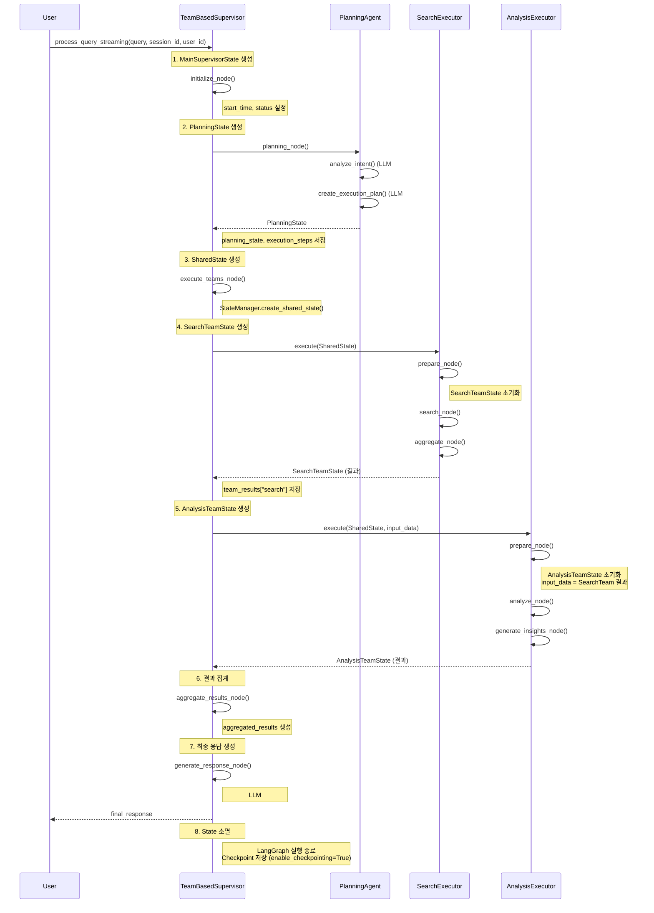

# State Management 가이드

**버전**: 1.0
**작성일**: 2025-10-14
**아키텍처**: LangGraph TypedDict State Management

---

## 📚 목차

- [개요](#-개요)
- [State 아키텍처](#-state-아키텍처)
- [전체 State 목록](#-전체-state-목록)
- [State 상세 명세](#-state-상세-명세)
- [State 라이프사이클](#-state-라이프사이클)
- [State 전달 메커니즘](#-state-전달-메커니즘)
- [State 유틸리티](#-state-유틸리티)
- [Best Practices](#-best-practices)
- [개발 가이드](#-개발-가이드)

---

## 🎯 개요

### State Management란?

State Management는 Multi-Agent 시스템에서 **각 Agent의 실행 상태와 데이터를 체계적으로 관리**하는 핵심 메커니즘입니다.

```
사용자 쿼리
    ↓
MainSupervisorState (최상위 State)
    ↓
PlanningState → 의도 분석 결과
    ↓
SharedState → 모든 팀에게 공유
    ↓
SearchTeamState / AnalysisTeamState / DocumentTeamState (팀별 State)
    ↓
MainSupervisorState (결과 집계)
    ↓
최종 응답
```

### 핵심 원칙

| 원칙 | 설명 |
|-----|------|
| **Immutability** | State는 읽기 전용, 수정 시 새로운 객체 반환 |
| **Separation** | 팀별 독립적인 State로 State Pollution 방지 |
| **TypedDict** | Python TypedDict로 명확한 타입 정의 |
| **Serialization** | LangGraph Checkpoint를 위한 msgpack 직렬화 지원 |
| **Validation** | StateValidator를 통한 자동 검증 |

### 파일 위치

- **State 정의**: [separated_states.py](../service_agent/foundation/separated_states.py)
- **State 사용**: [team_supervisor.py](../service_agent/supervisor/team_supervisor.py)

---

## 🏗️ State 아키텍처

### State 계층 구조

```
┌─────────────────────────────────────────────────────────────────┐
│                    MainSupervisorState                          │
│  - 최상위 State                                                  │
│  - 모든 팀 결과 통합                                              │
│  - Planning, Execution, Aggregation 단계 관리                   │
└────────────────────────┬────────────────────────────────────────┘
                         │
                         ├──> PlanningState
                         │    - 의도 분석 결과
                         │    - execution_steps (TODO 아이템)
                         │    - execution_strategy
                         │
                         ├──> SharedState
                         │    - 모든 Execution Agent 공유
                         │    - 최소한의 필수 필드만 포함
                         │
                         ├──> SearchTeamState
                         │    - SearchExecutor 전용
                         │    - 4가지 검색 결과
                         │    - legal/real_estate/loan/property
                         │
                         ├──> AnalysisTeamState
                         │    - AnalysisExecutor 전용
                         │    - 분석 결과, 인사이트, 보고서
                         │    - SearchTeam 결과를 input_data로 받음
                         │
                         └──> DocumentTeamState
                              - DocumentExecutor 전용
                              - 템플릿, 생성, 검토
```

### State 타입 분류

| 분류 | State 타입 | 용도 |
|-----|-----------|------|
| **Supervisor** | MainSupervisorState | 최상위 상태 관리 |
| **Planning** | PlanningState | 계획 수립 결과 |
| **Shared** | SharedState | 팀 간 공유 데이터 |
| **Execution** | SearchTeamState, AnalysisTeamState, DocumentTeamState | 팀별 실행 상태 |
| **Supporting** | ExecutionStepState, SearchKeywords, DocumentTemplate, etc. | 보조 데이터 구조 |

---

## 📋 전체 State 목록

### 1. 핵심 State (6개)

| State 이름 | 정의 위치 | 사용 위치 | 필드 수 | 설명 |
|-----------|---------|---------|--------|------|
| **MainSupervisorState** | [separated_states.py:286-332](../service_agent/foundation/separated_states.py#L286-L332) | TeamBasedSupervisor | 23 | 최상위 State, 모든 팀 결과 통합 |
| **PlanningState** | [separated_states.py:271-284](../service_agent/foundation/separated_states.py#L271-L284) | PlanningAgent | 11 | 의도 분석 + 실행 계획 |
| **SharedState** | [separated_states.py:59-72](../service_agent/foundation/separated_states.py#L59-L72) | All Execution Agents | 7 | 팀 간 공유 최소 State |
| **SearchTeamState** | [separated_states.py:77-110](../service_agent/foundation/separated_states.py#L77-L110) | SearchExecutor | 16 | 검색 팀 전용 State |
| **AnalysisTeamState** | [separated_states.py:202-234](../service_agent/foundation/separated_states.py#L202-L234) | AnalysisExecutor | 14 | 분석 팀 전용 State |
| **DocumentTeamState** | [separated_states.py:137-165](../service_agent/foundation/separated_states.py#L137-L165) | DocumentExecutor | 13 | 문서 팀 전용 State |

### 2. 보조 State (10개)

| State 이름 | 정의 위치 | 용도 |
|-----------|---------|------|
| **ExecutionStepState** | [separated_states.py:239-269](../service_agent/foundation/separated_states.py#L239-L269) | execution_steps의 표준 형식 (TODO 아이템) |
| **SearchKeywords** | [separated_states.py:51-57](../service_agent/foundation/separated_states.py#L51-L57) | 검색 키워드 구조 |
| **DocumentTemplate** | [separated_states.py:112-118](../service_agent/foundation/separated_states.py#L112-L118) | 문서 템플릿 구조 |
| **DocumentContent** | [separated_states.py:120-126](../service_agent/foundation/separated_states.py#L120-L126) | 문서 내용 구조 |
| **ReviewResult** | [separated_states.py:128-135](../service_agent/foundation/separated_states.py#L128-L135) | 문서 검토 결과 |
| **AnalysisInput** | [separated_states.py:167-172](../service_agent/foundation/separated_states.py#L167-L172) | 분석 입력 구조 |
| **AnalysisMetrics** | [separated_states.py:174-182](../service_agent/foundation/separated_states.py#L174-L182) | 분석 지표 구조 |
| **AnalysisInsight** | [separated_states.py:184-190](../service_agent/foundation/separated_states.py#L184-L190) | 분석 인사이트 구조 |
| **AnalysisReport** | [separated_states.py:192-200](../service_agent/foundation/separated_states.py#L192-L200) | 분석 보고서 구조 |
| **StandardResult** | [separated_states.py:26-45](../service_agent/foundation/separated_states.py#L26-L45) | Agent 표준 응답 포맷 (Phase 2) |

### 3. 유틸리티 클래스 (3개)

| 클래스 이름 | 정의 위치 | 주요 메서드 |
|-----------|---------|-----------|
| **StateManager** | [separated_states.py:352-586](../service_agent/foundation/separated_states.py#L352-L586) | create_shared_state, merge_team_results, update_step_status |
| **StateValidator** | [separated_states.py:591-683](../service_agent/foundation/separated_states.py#L591-L683) | validate_shared_state, validate_search_state, etc. |
| **StateTransition** | [separated_states.py:688-732](../service_agent/foundation/separated_states.py#L688-L732) | update_status, record_error, mark_completed |

---

## 🔍 State 상세 명세

### 1. MainSupervisorState

**파일**: [separated_states.py:286-332](../service_agent/foundation/separated_states.py#L286-L332)

**설명**: TeamBasedSupervisor의 최상위 State, 모든 하위 Agent의 결과를 통합 관리

```python
class MainSupervisorState(TypedDict, total=False):
    """
    total=False: 모든 필드가 선택적 (Optional)
    LangGraph StateGraph의 루트 State
    """
    # ============================================================================
    # 필수 필드 (Core)
    # ============================================================================
    query: str                              # 사용자 쿼리
    session_id: str                         # 세션 ID (UUID)
    request_id: str                         # 요청 ID (타임스탬프 기반)
    user_id: Optional[int]                  # 사용자 ID (Long-term Memory용)

    # ============================================================================
    # Planning 관련
    # ============================================================================
    planning_state: Optional[PlanningState]  # 계획 수립 결과
    execution_plan: Optional[Dict]           # 실행 계획 (간소화 버전)

    # ============================================================================
    # 팀별 State (Execution Agents)
    # ============================================================================
    search_team_state: Optional[Dict]        # SearchExecutor 결과
    document_team_state: Optional[Dict]      # DocumentExecutor 결과
    analysis_team_state: Optional[Dict]      # AnalysisExecutor 결과

    # ============================================================================
    # 실행 추적
    # ============================================================================
    current_phase: str                       # "initialization" | "planning" | "executing" | "aggregation" | "response_generation"
    active_teams: List[str]                  # 현재 실행 중인 팀 목록
    completed_teams: List[str]               # 완료된 팀 목록
    failed_teams: List[str]                  # 실패한 팀 목록

    # ============================================================================
    # 결과 집계
    # ============================================================================
    team_results: Dict[str, Any]             # 팀별 결과 저장
    aggregated_results: Dict[str, Any]       # 집계된 최종 결과
    final_response: Optional[Dict]           # 최종 응답 (LLM #10 생성)

    # ============================================================================
    # 타이밍
    # ============================================================================
    start_time: Optional[datetime]
    end_time: Optional[datetime]
    total_execution_time: Optional[float]

    # ============================================================================
    # Long-term Memory (Phase 1 추가)
    # ============================================================================
    loaded_memories: Optional[List[Dict]]    # 로드된 대화 기록
    user_preferences: Optional[Dict]         # 사용자 선호도
    memory_load_time: Optional[str]          # Memory 로드 시간 (ISO format)

    # ============================================================================
    # 에러 처리
    # ============================================================================
    error_log: List[str]
    status: str                              # "initialized" | "completed" | "error"
```

**사용 예시**:

```python
# TeamSupervisor.initialize_node()
state["start_time"] = datetime.now()
state["status"] = "initialized"
state["current_phase"] = "initialization"
state["active_teams"] = []
state["completed_teams"] = []
state["failed_teams"] = []
state["team_results"] = {}
state["error_log"] = []
```

**필드별 상세 설명**:

| 필드 | 타입 | 초기값 | 업데이트 시점 | 설명 |
|-----|------|-------|------------|------|
| `query` | `str` | 사용자 입력 | 초기화 | 사용자 쿼리 원본 |
| `session_id` | `str` | UUID | 초기화 | WebSocket 세션 ID |
| `user_id` | `Optional[int]` | None | 초기화 | Long-term Memory 사용자 ID |
| `planning_state` | `Optional[PlanningState]` | None | planning_node | 의도 분석 + 실행 계획 |
| `active_teams` | `List[str]` | [] | planning_node | 계획에서 선택된 팀 목록 |
| `completed_teams` | `List[str]` | [] | execute_teams_node | 실행 완료된 팀 목록 |
| `team_results` | `Dict[str, Any]` | {} | execute_teams_node | 팀별 실행 결과 |
| `aggregated_results` | `Dict[str, Any]` | {} | aggregate_results_node | 모든 팀 결과 통합 |
| `final_response` | `Optional[Dict]` | None | generate_response_node | LLM #10 최종 응답 |
| `loaded_memories` | `Optional[List[Dict]]` | None | planning_node | Long-term Memory 로드 결과 |

---

### 2. PlanningState

**파일**: [separated_states.py:271-284](../service_agent/foundation/separated_states.py#L271-L284)

**설명**: PlanningAgent가 생성하는 State, 의도 분석 결과와 실행 계획 포함

```python
class PlanningState(TypedDict):
    """계획 수립 전용 State"""
    # ============================================================================
    # 의도 분석 결과
    # ============================================================================
    raw_query: str                           # 원본 쿼리
    analyzed_intent: Dict[str, Any]          # 의도 분석 결과 (LLM #1)
    intent_confidence: float                 # 신뢰도 (0.0 ~ 1.0)

    # ============================================================================
    # Agent 선택 결과 (LLM #2, #3)
    # ============================================================================
    available_agents: List[str]              # 사용 가능한 Agent 목록
    available_teams: List[str]               # 사용 가능한 팀 목록 ["search", "analysis", "document"]

    # ============================================================================
    # 실행 계획 (TODO 아이템)
    # ============================================================================
    execution_steps: List[ExecutionStepState] # 실행 단계 목록 (TODO 아이템)
    execution_strategy: str                  # "sequential" | "parallel" | "pipeline"
    parallel_groups: Optional[List[List[str]]] # 병렬 실행 그룹

    # ============================================================================
    # 검증 및 메타데이터
    # ============================================================================
    plan_validated: bool                     # 계획 검증 여부
    validation_errors: List[str]             # 검증 오류
    estimated_total_time: float              # 예상 실행 시간 (초)
```

**analyzed_intent 구조**:

```python
{
    "intent_type": "legal_consult",         # IntentType enum value
    "confidence": 0.95,                     # 0.0 ~ 1.0
    "keywords": ["전세금", "5%", "인상"],    # 추출된 키워드
    "entities": {                            # 추출된 엔티티
        "금액": ["5%"],
        "계약유형": ["전세"]
    }
}
```

**execution_steps 구조** (ExecutionStepState 참조):

```python
[
    {
        "step_id": "step_0",
        "step_type": "search",
        "agent_name": "search_team",
        "team": "search",
        "task": "법률 정보 검색",
        "description": "법률 관련 정보 및 판례 검색",
        "status": "pending",               # "pending" | "in_progress" | "completed" | "failed"
        "progress_percentage": 0,          # 0-100
        "started_at": None,
        "completed_at": None,
        "result": None,
        "error": None
    },
    {
        "step_id": "step_1",
        "step_type": "analysis",
        "agent_name": "analysis_team",
        "team": "analysis",
        "task": "법률 데이터 분석",
        "description": "법률 데이터 분석 및 리스크 평가",
        "status": "pending",
        "progress_percentage": 0,
        "started_at": None,
        "completed_at": None,
        "result": None,
        "error": None
    }
]
```

**생성 위치**:

```python
# TeamSupervisor.planning_node()
planning_state = PlanningState(
    raw_query=query,
    analyzed_intent={...},
    intent_confidence=intent_result.confidence,
    available_agents=AgentRegistry.list_agents(enabled_only=True),
    available_teams=list(self.teams.keys()),
    execution_steps=[...],
    execution_strategy=execution_plan.strategy.value,
    parallel_groups=execution_plan.parallel_groups,
    plan_validated=True,
    validation_errors=[],
    estimated_total_time=execution_plan.estimated_time
)

state["planning_state"] = planning_state
```

---

### 3. SharedState

**파일**: [separated_states.py:59-72](../service_agent/foundation/separated_states.py#L59-L72)

**설명**: 모든 Execution Agent가 공유하는 최소한의 State

```python
class SharedState(TypedDict):
    """
    모든 팀이 공유하는 최소한의 상태
    - 필수 필드만 포함
    - 팀 간 통신의 기본 단위
    """
    user_query: str                          # 사용자 쿼리
    session_id: str                          # 세션 ID
    user_id: Optional[int]                   # 사용자 ID (로그인 시)
    timestamp: str                           # 타임스탬프 (ISO format)
    language: str                            # 언어 ("ko")
    status: Literal["pending", "processing", "completed", "error"]
    error_message: Optional[str]
```

**생성 위치**:

```python
# TeamSupervisor.execute_teams_node()
shared_state = StateManager.create_shared_state(
    query=state["query"],
    session_id=state["session_id"],
    user_id=state.get("user_id")
)
```

**전달 대상**:
- SearchExecutor.execute(shared_state)
- AnalysisExecutor.execute(shared_state, ...)
- DocumentExecutor.execute(shared_state, ...)

---

### 4. SearchTeamState

**파일**: [separated_states.py:77-110](../service_agent/foundation/separated_states.py#L77-L110)

**설명**: SearchExecutor 전용 State, 4가지 검색 결과 포함

```python
class SearchTeamState(TypedDict):
    """검색 팀 전용 State"""
    # ============================================================================
    # Team identification
    # ============================================================================
    team_name: str                           # "search"
    status: str                              # "pending" | "in_progress" | "completed" | "failed"

    # ============================================================================
    # Shared context
    # ============================================================================
    shared_context: Dict[str, Any]           # SharedState 포함

    # ============================================================================
    # Search specific - 입력
    # ============================================================================
    keywords: Optional[SearchKeywords]       # 추출된 키워드
    search_scope: List[str]                  # ["legal", "real_estate", "loan"]
    filters: Dict[str, Any]                  # 필터 조건

    # ============================================================================
    # Search specific - 결과
    # ============================================================================
    legal_results: List[Dict[str, Any]]      # HybridLegalSearch 결과
    real_estate_results: List[Dict[str, Any]] # MarketDataTool 결과 (시세)
    property_search_results: List[Dict[str, Any]] # RealEstateSearchTool 결과 (매물)
    loan_results: List[Dict[str, Any]]       # LoanDataTool 결과
    aggregated_results: Dict[str, Any]       # 집계 결과

    # ============================================================================
    # Metadata
    # ============================================================================
    total_results: int                       # 총 결과 수
    search_time: float                       # 검색 소요 시간
    sources_used: List[str]                  # 사용된 데이터 소스
    search_progress: Dict[str, str]          # 진행 상황

    # ============================================================================
    # Execution tracking
    # ============================================================================
    start_time: Optional[datetime]
    end_time: Optional[datetime]
    error: Optional[str]
    current_search: Optional[str]            # 현재 실행 중인 검색
    execution_strategy: Optional[str]        # "sequential" | "parallel"
```

**SearchKeywords 구조**:

```python
class SearchKeywords(TypedDict):
    """검색 키워드 구조"""
    legal: List[str]                         # 법률 키워드
    real_estate: List[str]                   # 부동산 키워드
    loan: List[str]                          # 대출 키워드
    general: List[str]                       # 일반 키워드
```

**사용 예시**:

```python
# SearchExecutor.prepare_node()
state["keywords"] = {
    "legal": ["전세금", "인상", "5%"],
    "real_estate": ["강남구", "아파트"],
    "loan": [],
    "general": []
}
state["search_scope"] = ["legal", "real_estate"]
```

**결과 전달**:

```python
# TeamSupervisor._extract_team_data()
extracted_data = {
    "legal_search": state.get("legal_results", []),      # 법률 검색 결과
    "real_estate_search": state.get("real_estate_results", []),  # 시세 조회 결과
    "loan_search": state.get("loan_results", [])         # 대출 정보
}
# → AnalysisTeam이 input_data로 받음
```

---

### 5. AnalysisTeamState

**파일**: [separated_states.py:202-234](../service_agent/foundation/separated_states.py#L202-L234)

**설명**: AnalysisExecutor 전용 State, 분석 결과와 인사이트 포함

```python
class AnalysisTeamState(TypedDict):
    """분석 팀 전용 State"""
    # ============================================================================
    # Team identification
    # ============================================================================
    team_name: str                           # "analysis"
    status: str

    # ============================================================================
    # Shared context
    # ============================================================================
    shared_context: Dict[str, Any]           # SharedState 포함

    # ============================================================================
    # Analysis specific - 입력
    # ============================================================================
    analysis_type: str                       # "comprehensive" | "market" | "risk" | "contract"
    input_data: Dict[str, Any]               # 입력 데이터 (SearchTeam 결과 포함)

    # ============================================================================
    # Analysis specific - 결과
    # ============================================================================
    raw_analysis: Dict[str, Any]             # 원시 분석 결과 (tool별)
    metrics: Dict[str, float]                # 계산된 지표
    insights: List[str]                      # LLM #8 인사이트
    report: Dict[str, Any]                   # LLM #9 분석 보고서
    visualization_data: Optional[Dict]       # 시각화 데이터
    recommendations: List[str]               # 추천사항
    confidence_score: float                  # 분석 신뢰도

    # ============================================================================
    # Progress tracking
    # ============================================================================
    analysis_progress: Dict[str, str]

    # ============================================================================
    # Timing
    # ============================================================================
    start_time: Optional[datetime]
    end_time: Optional[datetime]
    analysis_time: Optional[float]

    # ============================================================================
    # Error tracking
    # ============================================================================
    error: Optional[str]
```

**input_data 구조** (SearchTeam 결과 포함):

```python
{
    "legal_search": [
        {
            "law_name": "주택임대차보호법",
            "article": "제7조의2",
            "content": "임대차계약 갱신 시...",
            "similarity": 0.95
        }
    ],
    "real_estate_search": [
        {
            "region": "강남구 역삼동",
            "property_type": "apartment",
            "avg_deposit": 50000,
            "transaction_count": 100
        }
    ],
    "loan_search": [...]
}
```

**raw_analysis 구조** (tool별 결과):

```python
{
    "contract_analysis": {
        "risk_level": "medium",
        "risks": [
            {
                "type": "특약조항",
                "severity": "high",
                "clause": "임대인은 임의로..."
            }
        ]
    },
    "market_analysis": {
        "trend": "상승",
        "comparison": {...}
    },
    "roi_calculation": {
        "estimated_roi": 5.2,
        "payback_period": 12
    }
}
```

**사용 예시**:

```python
# AnalysisExecutor.execute()
result = await team.execute(
    shared_state,
    analysis_type="comprehensive",
    input_data=main_state.get("team_results", {})  # SearchTeam 결과 전달
)
```

---

### 6. DocumentTeamState

**파일**: [separated_states.py:137-165](../service_agent/foundation/separated_states.py#L137-L165)

**설명**: DocumentExecutor 전용 State, 템플릿 기반 문서 생성

```python
class DocumentTeamState(TypedDict):
    """문서 팀 전용 State"""
    # ============================================================================
    # Team identification
    # ============================================================================
    team_name: str                           # "document"
    status: str

    # ============================================================================
    # Shared context
    # ============================================================================
    shared_context: Dict[str, Any]           # SharedState 포함

    # ============================================================================
    # Document specific
    # ============================================================================
    document_type: str                       # "lease_contract" | "sales_contract"
    template: Optional[DocumentTemplate]     # 선택된 템플릿
    document_content: Optional[DocumentContent] # 문서 내용
    generation_progress: Dict[str, str]      # 생성 진행 상황

    # ============================================================================
    # Review specific
    # ============================================================================
    review_needed: bool                      # 검토 필요 여부
    review_result: Optional[ReviewResult]    # ContractAnalysisTool 검토 결과
    final_document: Optional[str]            # 최종 문서 (Markdown)

    # ============================================================================
    # Timing
    # ============================================================================
    start_time: Optional[datetime]
    end_time: Optional[datetime]
    generation_time: Optional[float]
    review_time: Optional[float]

    # ============================================================================
    # Error tracking
    # ============================================================================
    error: Optional[str]
```

**DocumentTemplate 구조**:

```python
class DocumentTemplate(TypedDict):
    """문서 템플릿 구조"""
    template_id: str                         # "lease_contract_v1"
    template_name: str                       # "주택임대차계약서"
    template_content: str                    # 템플릿 본문 (placeholders 포함)
    placeholders: List[str]                  # ["landlord_name", "tenant_name", ...]
```

**DocumentContent 구조**:

```python
class DocumentContent(TypedDict):
    """문서 내용 구조"""
    title: str                               # "주택임대차계약서"
    content: str                             # 생성된 문서 내용
    metadata: Dict[str, Any]                 # 메타데이터
    created_at: str                          # 생성 시간 (ISO format)
```

**ReviewResult 구조**:

```python
class ReviewResult(TypedDict):
    """검토 결과 구조"""
    reviewed: bool                           # 검토 완료 여부
    risk_level: str                          # "low" | "medium" | "high"
    risks: List[Dict[str, Any]]              # 발견된 리스크
    recommendations: List[str]               # 수정 권장사항
    compliance_check: Dict[str, bool]        # 법률 준수 체크
```

---

### 7. ExecutionStepState

**파일**: [separated_states.py:239-269](../service_agent/foundation/separated_states.py#L239-L269)

**설명**: execution_steps의 표준 형식, WebSocket을 통해 Frontend에 실시간 전송되는 TODO 아이템

```python
class ExecutionStepState(TypedDict):
    """
    execution_steps의 표준 형식 - TODO 아이템 + ProcessFlow 호환

    간소화된 TODO 관리: 실시간 WebSocket 업데이트용
    - Planning Agent가 생성
    - StateManager가 상태 업데이트
    - WebSocket으로 Frontend에 전송
    """
    # ============================================================================
    # 식별 정보 (4개)
    # ============================================================================
    step_id: str                             # 고유 ID (예: "step_0", "step_1")
    step_type: str                           # 'search' | 'analysis' | 'document'
    agent_name: str                          # 담당 에이전트 (예: "search_team")
    team: str                                # 담당 팀 (예: "search")

    # ============================================================================
    # 작업 정보 (2개)
    # ============================================================================
    task: str                                # 간단한 작업명 (예: "법률 정보 검색")
    description: str                         # 상세 설명 (사용자에게 표시)

    # ============================================================================
    # 상태 추적 (2개)
    # ============================================================================
    status: Literal["pending", "in_progress", "completed", "failed", "skipped"]
    progress_percentage: int                 # 진행률 0-100

    # ============================================================================
    # 타이밍 (2개)
    # ============================================================================
    started_at: Optional[str]                # 시작 시간 (ISO format datetime)
    completed_at: Optional[str]              # 완료 시간 (ISO format datetime)

    # ============================================================================
    # 결과/에러 (2개)
    # ============================================================================
    result: Optional[Dict[str, Any]]         # 실행 결과 데이터
    error: Optional[str]                     # 에러 메시지
```

**상태 변화 예시**:

```python
# 1. Planning 단계에서 생성 (초기 상태)
{
    "step_id": "step_0",
    "step_type": "search",
    "agent_name": "search_team",
    "team": "search",
    "task": "법률 정보 검색",
    "description": "법률 관련 정보 및 판례 검색",
    "status": "pending",              # ← 초기 상태
    "progress_percentage": 0,
    "started_at": None,
    "completed_at": None,
    "result": None,
    "error": None
}

# 2. 실행 시작 (in_progress)
{
    ...
    "status": "in_progress",          # ← 실행 시작
    "progress_percentage": 0,
    "started_at": "2025-10-14T10:30:00.000Z",
    ...
}

# 3. 실행 완료 (completed)
{
    ...
    "status": "completed",            # ← 실행 완료
    "progress_percentage": 100,
    "started_at": "2025-10-14T10:30:00.000Z",
    "completed_at": "2025-10-14T10:30:05.500Z",
    "result": {
        "legal_results": [...],
        "total_results": 15
    },
    "error": None
}

# 4. 실행 실패 (failed)
{
    ...
    "status": "failed",               # ← 실행 실패
    "progress_percentage": 50,
    "started_at": "2025-10-14T10:30:00.000Z",
    "completed_at": "2025-10-14T10:30:03.000Z",
    "result": None,
    "error": "Database connection timeout"
}
```

**업데이트 메서드**:

```python
# StateManager.update_step_status()
planning_state = StateManager.update_step_status(
    planning_state,
    step_id="step_0",
    new_status="in_progress",
    progress=0
)

# WebSocket으로 Frontend에 전송
await progress_callback("todo_updated", {
    "execution_steps": planning_state["execution_steps"]
})
```

---

## 🔄 State 라이프사이클

### 1. State 생성부터 소멸까지



### 2. 단계별 State 변화

| 단계 | Node | State 변화 | 데이터 |
|-----|------|----------|-------|
| **1. 초기화** | `initialize_node()` | `MainSupervisorState` 생성 | start_time, status="initialized" |
| **2. 계획** | `planning_node()` | `PlanningState` 생성 | analyzed_intent, execution_steps |
| **3. 공유 상태** | `execute_teams_node()` | `SharedState` 생성 | user_query, session_id, user_id |
| **4. 검색 실행** | `SearchExecutor.execute()` | `SearchTeamState` 생성 → 반환 | legal_results, real_estate_results, loan_results |
| **5. 분석 실행** | `AnalysisExecutor.execute()` | `AnalysisTeamState` 생성 → 반환 | insights, report, recommendations |
| **6. 문서 실행** | `DocumentExecutor.execute()` | `DocumentTeamState` 생성 → 반환 | generated_document, review_result |
| **7. 결과 집계** | `aggregate_results_node()` | `aggregated_results` 생성 | 모든 팀 결과 통합 |
| **8. 응답 생성** | `generate_response_node()` | `final_response` 생성 | LLM #10 최종 응답, Long-term Memory 저장 |

### 3. State 필드 업데이트 타임라인

```python
# t=0: 초기화
MainSupervisorState {
    "query": "전세금 5% 인상 가능한가요?",
    "session_id": "abc123",
    "user_id": 42,
    "start_time": datetime.now(),
    "status": "initialized",
    "current_phase": "initialization",
    "active_teams": [],
    "completed_teams": [],
    "team_results": {},
    "error_log": []
}

# t=1: Planning 완료
MainSupervisorState {
    ...
    "current_phase": "planning",
    "planning_state": {
        "analyzed_intent": {"intent_type": "legal_consult", ...},
        "execution_steps": [{"step_id": "step_0", ...}, ...],
        "execution_strategy": "sequential"
    },
    "active_teams": ["search", "analysis"],
    "loaded_memories": [...],  # Long-term Memory 로드
    "user_preferences": {...}
}

# t=2: SearchTeam 실행 중
MainSupervisorState {
    ...
    "current_phase": "executing",
    "active_teams": ["search", "analysis"],
    "completed_teams": [],
    "planning_state": {
        "execution_steps": [
            {"step_id": "step_0", "status": "in_progress", ...},  # ← 업데이트
            {"step_id": "step_1", "status": "pending", ...}
        ]
    }
}

# t=3: SearchTeam 완료
MainSupervisorState {
    ...
    "completed_teams": ["search"],
    "team_results": {
        "search": {
            "legal_search": [...],
            "real_estate_search": [...]
        }
    },
    "planning_state": {
        "execution_steps": [
            {"step_id": "step_0", "status": "completed", "result": {...}},  # ← 완료
            {"step_id": "step_1", "status": "pending", ...}
        ]
    }
}

# t=4: AnalysisTeam 완료
MainSupervisorState {
    ...
    "completed_teams": ["search", "analysis"],
    "team_results": {
        "search": {...},
        "analysis": {
            "report": {...},
            "insights": [...]
        }
    },
    "planning_state": {
        "execution_steps": [
            {"step_id": "step_0", "status": "completed", ...},
            {"step_id": "step_1", "status": "completed", ...}  # ← 완료
        ]
    }
}

# t=5: 결과 집계
MainSupervisorState {
    ...
    "current_phase": "aggregation",
    "aggregated_results": {
        "search": {"status": "success", "data": {...}},
        "analysis": {"status": "success", "data": {...}}
    }
}

# t=6: 최종 응답 생성
MainSupervisorState {
    ...
    "current_phase": "response_generation",
    "final_response": {
        "type": "comprehensive_analysis",
        "answer": "전세금 5% 인상은 주택임대차보호법...",
        "summary": "...",
        "data": {...}
    },
    "status": "completed",
    "end_time": datetime.now(),
    "total_execution_time": 5.2
}
# → Long-term Memory 저장
# → WebSocket으로 Frontend 전송
# → LangGraph Checkpoint 저장 (enable_checkpointing=True)
```

---

## 🔗 State 전달 메커니즘

### 1. Supervisor → Execution Agents (SharedState)

**전달 방식**: 메서드 파라미터

```python
# TeamSupervisor.execute_teams_node()
shared_state = StateManager.create_shared_state(
    query=state["query"],
    session_id=state["session_id"],
    user_id=state.get("user_id")
)

# SearchExecutor에 전달
await self.teams["search"].execute(shared_state)

# AnalysisExecutor에 전달 (+ 추가 데이터)
await self.teams["analysis"].execute(
    shared_state,
    analysis_type="comprehensive",
    input_data=main_state.get("team_results", {})
)
```

### 2. SearchTeam → AnalysisTeam (team_results)

**전달 방식**: MainSupervisorState.team_results

```python
# TeamSupervisor._execute_teams_sequential()
for team_name in teams:
    result = await self._execute_single_team(team_name, shared_state, main_state)

    # SearchTeam 완료 후 결과 저장
    if team_name == "search":
        main_state["team_results"][team_name] = self._extract_team_data(result, team_name)
        # → {
        #     "legal_search": [...],
        #     "real_estate_search": [...],
        #     "loan_search": [...]
        # }

# AnalysisTeam 실행 시 input_data로 전달
if team_name == "analysis":
    input_data = main_state.get("team_results", {})  # ← SearchTeam 결과 포함
    return await team.execute(
        shared_state,
        analysis_type="comprehensive",
        input_data=input_data
    )
```

### 3. Execution Agents → Supervisor (반환값)

**전달 방식**: 반환값 + StateManager.merge_team_results()

```python
# SearchExecutor.execute() → SearchTeamState 반환
result = await team.execute(shared_state)

# Supervisor가 결과 병합
state = StateManager.merge_team_results(state, team_name, result)
# → state["team_results"][team_name] = result
# → state["completed_teams"].append(team_name)
```

### 4. StateManager를 통한 State 병합

**파일**: [separated_states.py:454-498](../service_agent/foundation/separated_states.py#L454-L498)

```python
@staticmethod
def merge_team_results(
    main_state: MainSupervisorState,
    team_name: str,
    team_result: Dict[str, Any]
) -> MainSupervisorState:
    """
    팀 결과를 MainSupervisorState에 병합
    """
    # 팀 결과 저장
    if "team_results" not in main_state:
        main_state["team_results"] = {}
    main_state["team_results"][team_name] = team_result

    # 완료/실패 팀 목록 업데이트
    if team_result.get("status") in ["completed", "success"]:
        if "completed_teams" not in main_state:
            main_state["completed_teams"] = []
        if team_name not in main_state["completed_teams"]:
            main_state["completed_teams"].append(team_name)
    else:
        if "failed_teams" not in main_state:
            main_state["failed_teams"] = []
        if team_name not in main_state["failed_teams"]:
            main_state["failed_teams"].append(team_name)

    # active_teams에서 제거
    if "active_teams" in main_state and team_name in main_state["active_teams"]:
        main_state["active_teams"].remove(team_name)

    return main_state
```

### 5. WebSocket을 통한 실시간 State 전송

**전달 방식**: progress_callback (Callable)

```python
# TeamSupervisor.process_query_streaming()
if progress_callback:
    self._progress_callbacks[session_id] = progress_callback

# Planning 완료 알림
await progress_callback("plan_ready", {
    "intent": intent_result.intent_type.value,
    "confidence": intent_result.confidence,
    "execution_steps": planning_state["execution_steps"],
    "execution_strategy": execution_plan.strategy.value,
    "estimated_total_time": execution_plan.estimated_time
})

# TODO 상태 업데이트
await progress_callback("todo_updated", {
    "execution_steps": planning_state["execution_steps"]
})

# 최종 응답
await progress_callback("response", {
    "type": "comprehensive_analysis",
    "answer": "...",
    "data": {...}
})
```

**WebSocket 이벤트 타입**:

| 이벤트 | 데이터 | 설명 |
|-------|-------|------|
| `planning_start` | `{"message": "..."}` | 계획 수립 시작 |
| `plan_ready` | `{"execution_steps": [...], ...}` | 계획 완료 |
| `execution_start` | `{"execution_steps": [...], ...}` | 실행 시작 |
| `todo_updated` | `{"execution_steps": [...]}` | TODO 상태 변경 |
| `response` | `{"type": "...", "answer": "...", ...}` | 최종 응답 |
| `error` | `{"error": "...", "message": "..."}` | 에러 발생 |

---

## 🛠️ State 유틸리티

### 1. StateManager

**파일**: [separated_states.py:352-586](../service_agent/foundation/separated_states.py#L352-L586)

**주요 메서드**:

#### 1.1 create_shared_state()

```python
@staticmethod
def create_shared_state(
    query: str,
    session_id: str,
    user_id: Optional[int] = None,
    language: str = "ko",
    timestamp: Optional[str] = None
) -> SharedState:
    """공유 State 생성"""
    if timestamp is None:
        timestamp = datetime.now().isoformat()

    return SharedState(
        user_query=query,
        session_id=session_id,
        user_id=user_id,
        timestamp=timestamp,
        language=language,
        status="pending",
        error_message=None
    )
```

**사용 예시**:

```python
shared_state = StateManager.create_shared_state(
    query="전세금 5% 인상 가능한가요?",
    session_id="abc123",
    user_id=42
)
```

#### 1.2 update_step_status()

```python
@staticmethod
def update_step_status(
    planning_state: PlanningState,
    step_id: str,
    new_status: Literal["pending", "in_progress", "completed", "failed", "skipped"],
    progress: Optional[int] = None,
    error: Optional[str] = None
) -> PlanningState:
    """
    개별 execution_step의 상태 업데이트
    """
    for step in planning_state["execution_steps"]:
        if step["step_id"] == step_id:
            step["status"] = new_status

            # 진행률 업데이트
            if progress is not None:
                step["progress_percentage"] = progress

            # 시작 시간 기록
            if new_status == "in_progress" and not step.get("started_at"):
                step["started_at"] = datetime.now().isoformat()

            # 완료 시간 기록
            if new_status in ["completed", "failed", "skipped"]:
                step["completed_at"] = datetime.now().isoformat()

            # 에러 기록
            if error:
                step["error"] = error

            break

    return planning_state
```

**사용 예시**:

```python
# 실행 시작
planning_state = StateManager.update_step_status(
    planning_state,
    step_id="step_0",
    new_status="in_progress",
    progress=0
)

# 실행 완료
planning_state = StateManager.update_step_status(
    planning_state,
    step_id="step_0",
    new_status="completed",
    progress=100
)
```

#### 1.3 merge_team_results()

```python
@staticmethod
def merge_team_results(
    main_state: MainSupervisorState,
    team_name: str,
    team_result: Dict[str, Any]
) -> MainSupervisorState:
    """팀 결과를 MainSupervisorState에 병합"""
    # 팀 결과 저장
    if "team_results" not in main_state:
        main_state["team_results"] = {}
    main_state["team_results"][team_name] = team_result

    # 완료/실패 팀 목록 업데이트
    if team_result.get("status") in ["completed", "success"]:
        if "completed_teams" not in main_state:
            main_state["completed_teams"] = []
        if team_name not in main_state["completed_teams"]:
            main_state["completed_teams"].append(team_name)
    else:
        if "failed_teams" not in main_state:
            main_state["failed_teams"] = []
        if team_name not in main_state["failed_teams"]:
            main_state["failed_teams"].append(team_name)

    # active_teams에서 제거
    if "active_teams" in main_state and team_name in main_state["active_teams"]:
        main_state["active_teams"].remove(team_name)

    return main_state
```

**사용 예시**:

```python
# SearchTeam 결과 병합
state = StateManager.merge_team_results(
    state,
    "search",
    search_result
)
```

#### 1.4 create_initial_team_state()

```python
@staticmethod
def create_initial_team_state(
    team_type: str,
    shared_state: SharedState,
    additional_data: Optional[Dict[str, Any]] = None
) -> Dict[str, Any]:
    """팀별 초기 State 생성"""
    base_fields = {
        "team_name": team_type,
        "status": "initialized",
        "shared_context": dict(shared_state),
        "start_time": None,
        "end_time": None,
        "error": None
    }

    if team_type == "search":
        state = {
            **base_fields,
            "keywords": None,
            "search_scope": ["legal", "real_estate", "loan"],
            "filters": {},
            "legal_results": [],
            "real_estate_results": [],
            "loan_results": [],
            "property_search_results": [],
            "aggregated_results": {},
            "total_results": 0,
            "search_time": 0.0,
            "sources_used": [],
            "search_progress": {},
            "current_search": None,
            "execution_strategy": None
        }
    # ... (analysis, document 생략)

    if additional_data:
        state.update(additional_data)

    return state
```

---

### 2. StateValidator

**파일**: [separated_states.py:591-683](../service_agent/foundation/separated_states.py#L591-L683)

**주요 메서드**:

#### 2.1 validate_shared_state()

```python
@staticmethod
def validate_shared_state(state: Dict[str, Any]) -> tuple[bool, List[str]]:
    """공유 State 검증"""
    errors = []

    # Required fields
    required_fields = ["user_query", "session_id"]
    for field in required_fields:
        if not state.get(field):
            errors.append(f"{field} is required")

    # Status validation
    valid_statuses = ["pending", "processing", "completed", "error"]
    if state.get("status") and state["status"] not in valid_statuses:
        errors.append(f"Invalid status: {state['status']}")

    return len(errors) == 0, errors
```

**사용 예시**:

```python
is_valid, errors = StateValidator.validate_shared_state(shared_state)
if not is_valid:
    logger.error(f"Validation errors: {errors}")
    raise ValueError(f"Invalid shared state: {errors}")
```

#### 2.2 validate_search_state()

```python
@staticmethod
def validate_search_state(state: Dict[str, Any]) -> tuple[bool, List[str]]:
    """검색 팀 State 검증"""
    errors = []

    # Check shared state first
    is_valid, shared_errors = StateValidator.validate_shared_state(
        state.get("shared_context", {})
    )
    errors.extend(shared_errors)

    # Search specific validation
    search_scope = state.get("search_scope", [])
    valid_scopes = ["legal", "real_estate", "loan"]
    for scope in search_scope:
        if scope not in valid_scopes:
            errors.append(f"Invalid search scope: {scope}")

    return len(errors) == 0, errors
```

---

### 3. StateTransition

**파일**: [separated_states.py:688-732](../service_agent/foundation/separated_states.py#L688-L732)

**주요 메서드**:

#### 3.1 update_status()

```python
@staticmethod
def update_status(state: Dict[str, Any], new_status: str) -> Dict[str, Any]:
    """Update status with logging"""
    old_status = state.get("status", "unknown")
    state["status"] = new_status
    logger.info(f"Status transition: {old_status} -> {new_status}")
    return state
```

#### 3.2 record_error()

```python
@staticmethod
def record_error(state: Dict[str, Any], error: str) -> Dict[str, Any]:
    """Record error in state"""
    state["error"] = error
    state["status"] = "error"
    if "error_log" not in state:
        state["error_log"] = []
    state["error_log"].append({
        "timestamp": datetime.now().isoformat(),
        "error": error
    })
    logger.error(f"Error recorded: {error}")
    return state
```

#### 3.3 mark_completed()

```python
@staticmethod
def mark_completed(state: Dict[str, Any], result: Any = None) -> Dict[str, Any]:
    """Mark task as completed"""
    state["status"] = "completed"
    state["end_time"] = datetime.now()
    if result is not None:
        state["result"] = result

    # Calculate execution time
    if state.get("start_time"):
        delta = state["end_time"] - state["start_time"]
        state["execution_time"] = delta.total_seconds()
        logger.info(f"Task completed in {state['execution_time']:.2f} seconds")

    return state
```

---

## ✅ Best Practices

### 1. State 설계 원칙

#### DO ✅

```python
# 1. TypedDict 사용으로 명확한 타입 정의
class MyState(TypedDict):
    field1: str
    field2: Optional[int]

# 2. 팀별 독립적인 State 사용 (State Pollution 방지)
SearchTeamState  # SearchExecutor 전용
AnalysisTeamState  # AnalysisExecutor 전용

# 3. SharedState로 공통 데이터 공유
shared_state = StateManager.create_shared_state(query, session_id)

# 4. StateManager 유틸리티 사용
state = StateManager.merge_team_results(state, team_name, result)

# 5. StateValidator로 검증
is_valid, errors = StateValidator.validate_shared_state(state)
```

#### DON'T ❌

```python
# 1. State에 Callable 포함하지 않기 (직렬화 불가)
class BadState(TypedDict):
    callback: Callable  # ❌ msgpack 직렬화 불가

# 해결: Supervisor 인스턴스에서 별도 관리
self._progress_callbacks: Dict[str, Callable] = {}

# 2. State 직접 수정하지 않기
state["field"] = "new_value"  # ❌ Immutability 위반

# 해결: 새로운 객체 반환
new_state = StateManager.update_step_status(state, ...)

# 3. State에 대량 데이터 저장하지 않기
state["all_data"] = [...]  # ❌ 10MB+ 데이터

# 해결: 요약 정보만 저장, 원본은 DB/파일
state["summary"] = {"count": 100, "top_items": [...]}

# 4. 팀 간 State 직접 공유하지 않기
# ❌ SearchTeamState를 AnalysisTeam에 직접 전달
await analysis_team.execute(search_team_state)

# ✅ SharedState + input_data 사용
await analysis_team.execute(shared_state, input_data=...)
```

### 2. State 전달 Best Practices

```python
# 1. SharedState를 통한 공통 데이터 전달
shared_state = StateManager.create_shared_state(
    query=state["query"],
    session_id=state["session_id"],
    user_id=state.get("user_id")
)

# 2. team_results를 통한 팀 간 데이터 전달
if team_name == "search":
    main_state["team_results"]["search"] = self._extract_team_data(result, "search")

if team_name == "analysis":
    input_data = main_state.get("team_results", {})  # SearchTeam 결과 포함
    await team.execute(shared_state, input_data=input_data)

# 3. StateManager를 통한 State 병합
state = StateManager.merge_team_results(state, team_name, result)

# 4. ExecutionStepState 업데이트 + WebSocket 전송
planning_state = StateManager.update_step_status(
    planning_state,
    step_id="step_0",
    new_status="completed",
    progress=100
)
await progress_callback("todo_updated", {
    "execution_steps": planning_state["execution_steps"]
})
```

### 3. State 검증 Best Practices

```python
# 1. State 생성 직후 검증
shared_state = StateManager.create_shared_state(...)
is_valid, errors = StateValidator.validate_shared_state(shared_state)
if not is_valid:
    raise ValueError(f"Invalid state: {errors}")

# 2. Critical 필드 체크
if not state.get("session_id"):
    raise ValueError("session_id is required")

# 3. 타입 체크 (mypy 사용 권장)
def process_state(state: MainSupervisorState) -> MainSupervisorState:
    # mypy가 타입 체크
    return state
```

### 4. State 디버깅 Best Practices

```python
# 1. 로깅으로 State 변화 추적
logger.info(f"State updated: {state.get('current_phase')}")
logger.debug(f"Team results: {list(state.get('team_results', {}).keys())}")

# 2. State 스냅샷 저장 (디버깅용)
import json
with open(f"state_snapshot_{datetime.now().timestamp()}.json", "w") as f:
    json.dump(state, f, default=str, indent=2)

# 3. State 크기 모니터링
import sys
state_size = sys.getsizeof(str(state))
if state_size > 1_000_000:  # 1MB
    logger.warning(f"Large state detected: {state_size} bytes")
```

---

## 📖 개발 가이드

### 1. 새로운 State 추가하기

#### Step 1: TypedDict 정의

**파일**: [separated_states.py](../service_agent/foundation/separated_states.py)

```python
class NewTeamState(TypedDict):
    """새로운 팀 전용 State"""
    # Team identification
    team_name: str
    status: str

    # Shared context
    shared_context: Dict[str, Any]

    # Team specific fields
    custom_field1: str
    custom_field2: Optional[int]

    # Results
    team_results: Dict[str, Any]

    # Timing
    start_time: Optional[datetime]
    end_time: Optional[datetime]

    # Error tracking
    error: Optional[str]
```

#### Step 2: StateManager에 초기화 메서드 추가

```python
# StateManager.create_initial_team_state()
elif team_type == "new_team":
    state = {
        **base_fields,
        "custom_field1": "",
        "custom_field2": None,
        "team_results": {}
    }
```

#### Step 3: StateValidator에 검증 메서드 추가

```python
@staticmethod
def validate_new_team_state(state: Dict[str, Any]) -> tuple[bool, List[str]]:
    """새로운 팀 State 검증"""
    errors = []

    # Check shared state
    is_valid, shared_errors = StateValidator.validate_shared_state(
        state.get("shared_context", {})
    )
    errors.extend(shared_errors)

    # Team specific validation
    if not state.get("custom_field1"):
        errors.append("custom_field1 is required")

    return len(errors) == 0, errors
```

#### Step 4: Executor에서 사용

```python
class NewExecutor:
    async def execute(self, shared_state: SharedState) -> NewTeamState:
        # 초기 State 생성
        state = StateManager.create_initial_team_state(
            "new_team",
            shared_state
        )

        # 검증
        is_valid, errors = StateValidator.validate_new_team_state(state)
        if not is_valid:
            raise ValueError(f"Invalid state: {errors}")

        # 작업 실행
        state["custom_field1"] = "processed"
        state["team_results"] = {...}

        # State 완료 처리
        state = StateTransition.mark_completed(state, result={...})

        return state
```

### 2. State 필드 추가하기

#### MainSupervisorState에 필드 추가

```python
# separated_states.py
class MainSupervisorState(TypedDict, total=False):
    # ... 기존 필드

    # 새로운 필드 추가
    new_field: Optional[str]
```

#### TeamSupervisor에서 초기화

```python
# team_supervisor.py
async def initialize_node(self, state: MainSupervisorState) -> MainSupervisorState:
    # ... 기존 초기화

    state["new_field"] = None  # 새로운 필드 초기화

    return state
```

### 3. State 디버깅 가이드

#### State 로깅

```python
# 전체 State 로깅
logger.debug(f"Current state: {json.dumps(state, default=str, indent=2)}")

# 특정 필드만 로깅
logger.info(f"Planning state: {state.get('planning_state', {}).get('execution_strategy')}")
```

#### State 스냅샷

```python
# 디버깅용 State 스냅샷 저장
def save_state_snapshot(state: Dict, label: str):
    filename = f"state_{label}_{datetime.now().timestamp()}.json"
    with open(filename, "w") as f:
        json.dump(state, f, default=str, indent=2)
    logger.info(f"State snapshot saved: {filename}")

# 사용
save_state_snapshot(state, "after_planning")
save_state_snapshot(state, "after_execution")
```

#### State 검증

```python
# State 일관성 체크
def check_state_consistency(state: MainSupervisorState):
    # active_teams와 execution_steps의 team 일치 여부 체크
    active_teams = set(state.get("active_teams", []))
    execution_teams = set(
        step["team"] for step in state.get("planning_state", {}).get("execution_steps", [])
    )

    if active_teams != execution_teams:
        logger.warning(f"State inconsistency: active_teams={active_teams}, execution_teams={execution_teams}")

# 사용
check_state_consistency(state)
```

### 4. State 성능 최적화

#### State 크기 최소화

```python
# 대량 데이터는 State에 저장하지 않기
# ❌ 10MB 데이터를 State에 저장
state["all_search_results"] = [...]  # 10,000개 결과

# ✅ 요약만 State에 저장, 원본은 별도 저장
state["search_summary"] = {
    "total_count": 10000,
    "top_10": [...],
    "data_location": "s3://bucket/search_results_123.json"
}
```

#### State 직렬화 최적화

```python
# Checkpoint 직렬화 시 불필요한 필드 제외
def prepare_state_for_checkpoint(state: MainSupervisorState) -> MainSupervisorState:
    checkpoint_state = state.copy()

    # 대용량 필드 제거
    if "loaded_memories" in checkpoint_state:
        del checkpoint_state["loaded_memories"]

    return checkpoint_state
```

---

## 🎓 추가 참고 자료

- [EXECUTION_AGENTS_GUIDE.md](./EXECUTION_AGENTS_GUIDE.md) - Execution Agents 가이드
- [TOOLS_REFERENCE.md](./TOOLS_REFERENCE.md) - Tools API 레퍼런스
- [SYSTEM_FLOW_DIAGRAM.md](./SYSTEM_FLOW_DIAGRAM.md) - 전체 시스템 흐름도
- [DATABASE_GUIDE.md](./DATABASE_GUIDE.md) - Database 스키마 가이드
- [API_REFERENCE.md](./API_REFERENCE.md) - REST API 레퍼런스

---

**문서 버전**: 1.0
**최종 업데이트**: 2025-10-14
**작성자**: Claude Code
**문의**: 개발팀
