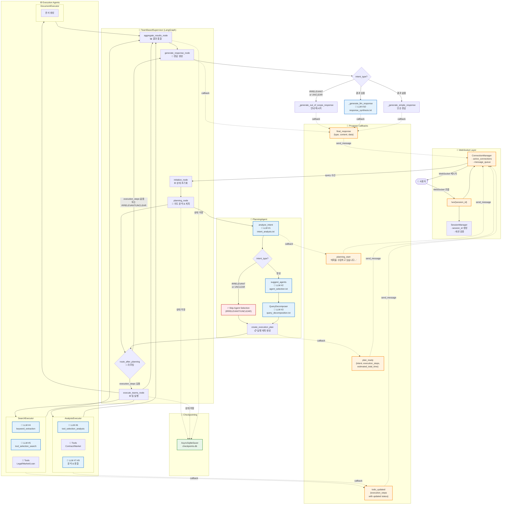

# 부동산 AI 시스템 흐름도 v2

**버전**: 2.0
**작성일**: 2025-10-10
**주요 변경사항**: WebSocket 실시간 통신, Progress Flow UI, Checkpointing 반영

---

## 🔄 v1에서 v2로의 주요 변경점

| 항목 | v1 | v2 |
|------|----|----|
| **통신 방식** | HTTP POST | WebSocket (실시간) |
| **응답 방식** | 동기식 (완료 후 응답) | 스트리밍 (progress_callback) |
| **프론트엔드** | 단순 로딩 스피너 | ExecutionPlanPage + ExecutionProgressPage |
| **State 관리** | In-memory | LangGraph Checkpointing (SQLite) |
| **Todo 관리** | 없음 | 실시간 todo 업데이트 (pending → in_progress → completed) |

---

## 전체 시스템 아키텍처 (LLM 호출 지점 표시)



## LLM 호출 지점 상세 정리

### 📊 LLM 호출 통계

| # | 호출 위치 | 프롬프트 파일 | 모델 | Temperature | 호출 방식 | 목적 |
|---|----------|-------------|------|-------------|----------|------|
| 1 | PlanningAgent | `intent_analysis.txt` | GPT-4o-mini | 0.0 | async | 사용자 의도 분석 |
| 2 | PlanningAgent | `agent_selection.txt` | GPT-4o-mini | 0.0 | async | Agent 선택 (IRRELEVANT/UNCLEAR은 생략⚡) |
| 2b | PlanningAgent (fallback) | `agent_selection_simple.txt` | GPT-4o-mini | 0.0 | async | 단순 Agent 선택 |
| 3 | QueryDecomposer | `query_decomposition.txt` | GPT-4o-mini | 0.1 | async | 복합 질문 분해 |
| 4 | SearchExecutor | `keyword_extraction.txt` | GPT-4o-mini | 0.1 | **sync** | 검색 키워드 추출 |
| 5 | SearchExecutor | `tool_selection_search.txt` | GPT-4o-mini | 0.1 | async | 검색 도구 선택 |
| 6 | AnalysisExecutor | `tool_selection_analysis.txt` | GPT-4o-mini | 0.0 | async | 분석 도구 선택 |
| 7 | ContractAnalysisTool | ⚠️ 인라인 프롬프트 | GPT-4o-mini | 0.3 | async | 계약서 분석 |
| 8 | MarketAnalysisTool | `insight_generation.txt` | GPT-4o-mini | 0.3 | async | 시장 인사이트 생성 |
| 9 | AnalysisExecutor | `insight_generation.txt` | GPT-4o-mini | 0.3 | async | 분석 인사이트 종합 |
| 10 | TeamSupervisor | `response_synthesis.txt` | GPT-4o-mini | 0.3 | async | 최종 응답 생성 |

### 📁 프롬프트 파일 위치

#### Cognitive Prompts (인지 에이전트)
```
backend/app/service_agent/llm_manager/prompts/cognitive/
├── intent_analysis.txt          ✅ 사용됨 (LLM #1)
├── agent_selection.txt          ✅ 사용됨 (LLM #2)
├── agent_selection_simple.txt   ✅ 사용됨 (LLM #2b, fallback)
├── query_decomposition.txt      ✅ 사용됨 (LLM #3)
└── plan_generation.txt          ❌ 미사용
```

#### Execution Prompts (실행 에이전트)
```
backend/app/service_agent/llm_manager/prompts/execution/
├── keyword_extraction.txt       ✅ 사용됨 (LLM #4)
├── tool_selection_search.txt    ✅ 사용됨 (LLM #5)
├── tool_selection_analysis.txt  ✅ 사용됨 (LLM #6)
├── insight_generation.txt       ✅ 사용됨 (LLM #8, #9)
└── response_synthesis.txt       ✅ 사용됨 (LLM #10)
```

#### Common Prompts
```
backend/app/service_agent/llm_manager/prompts/common/
└── error_response.txt           ❌ 미사용
```

#### ⚠️ 누락된 프롬프트 파일
- `contract_analysis.txt` - ContractAnalysisTool에서 인라인 프롬프트 사용 중

## 📡 WebSocket 메시지 프로토콜

### Client → Server

| 메시지 타입 | 필드 | 설명 |
|------------|------|------|
| `query` | `query`, `enable_checkpointing` | 사용자 쿼리 전송 |
| `interrupt_response` | `action`, `modified_todos` | Plan 승인/수정 (TODO) |
| `todo_skip` | `todo_id` | Todo 건너뛰기 (TODO) |

### Server → Client

| 메시지 타입 | 발생 시점 | 필드 | 프론트엔드 동작 |
|------------|----------|------|---------------|
| `connected` | WebSocket 연결 시 | - | 연결 확인 |
| `planning_start` | planning_node 시작 | `message` | 스피너 표시 |
| `plan_ready` | planning_node 완료 | `intent`, `confidence`, `execution_steps`, `estimated_total_time`, `keywords` | ExecutionPlanPage 생성<br/>800ms 후 ExecutionProgressPage 생성 |
| `todo_created` | 초기 todo 생성 | `execution_steps` | (미사용) |
| `todo_updated` | Step 상태 변경 | `execution_steps` | ExecutionProgressPage의 steps 업데이트 |
| `step_start` | Step 시작 | `agent`, `task` | (현재 미사용) |
| `step_progress` | Step 진행 중 | `progress_percentage` | (현재 미사용) |
| `step_complete` | Step 완료 | `result` | (현재 미사용) |
| `final_response` | generate_response_node 완료 | `response` (content/answer/message) | Progress 제거<br/>답변 표시<br/>idle 전환 |
| `error` | 에러 발생 | `error` | 에러 메시지 표시<br/>idle 전환 |

---

## 🔄 주요 처리 흐름 (시나리오별)

### 1. IRRELEVANT 쿼리 (빠른 경로) ⚡

```
사용자: "안녕" 입력
   ↓
Frontend: WebSocket 연결 → query 전송
   ↓
Backend: initialize_node
   └─ State 초기화 (LLM 호출 없음)
   ↓
planning_node
   ├─ 🤖 LLM #1: intent_analysis → IRRELEVANT
   ├─ ⚡ Skip LLM #2 (agent_selection)
   └─ create_execution_plan → Empty Plan (execution_steps: [])
   ↓
route_after_planning (라우팅 결정, LLM 호출 없음)
   └─ if intent_type == "irrelevant" → return "respond"
   ↓
⚡ execute_teams_node 건너뛰기 (바로 generate_response_node로)
⚡ aggregate_results_node 건너뛰기
   ↓
generate_response_node
   ├─ if intent_type == "irrelevant":
   └─ _generate_out_of_scope_response() → 안내 메시지 (LLM 호출 없음)
   ↓
final_response 전송 → Frontend
   ↓
Frontend: 안내 메시지 표시
```

**거치는 노드**: initialize → planning → route → generate_response → END
**건너뛴 노드**: ❌ execute_teams, ❌ aggregate

**WebSocket 메시지**:
1. `planning_start` → 스피너 표시
2. `plan_ready` (execution_steps: []) → ExecutionPlanPage 생성 시도 (빈 배열)
3. `final_response` (type: "guidance") → 안내 메시지 표시

**LLM 호출**: 1회만 (LLM #1: intent_analysis)
**소요 시간**: ~0.6초

---

### 2. 단순 부동산 질문 (일반 경로)

```
사용자: "전세금 인상기준은?" 입력
   ↓
Frontend: WebSocket 연결 → query 전송
   ↓
Backend: initialize_node
   └─ State 초기화 (LLM 호출 없음)
   ↓
planning_node
   ├─ 🤖 LLM #1: intent_analysis → LEGAL_CONSULT
   ├─ 🤖 LLM #2: agent_selection → ["search_team"]
   └─ create_execution_plan → Simple Plan (1 step)
   ↓
route_after_planning (라우팅 결정, LLM 호출 없음)
   └─ if execution_steps 있음 → return "execute"
   ↓
execute_teams_node
   ├─ strategy = "sequential" (순차 실행)
   ├─ SearchTeam 시작 → todo_updated (step 0: in_progress)
   │  ├─ 🤖 LLM #4: keyword_extraction
   │  ├─ 🤖 LLM #5: tool_selection_search
   │  └─ Tools 실행 (LegalSearchTool, LLM 호출 없음)
   └─ SearchTeam 완료 → todo_updated (step 0: completed)
   ↓
aggregate_results_node
   └─ 결과 통합 (LLM 호출 없음)
   ↓
generate_response_node
   ├─ if 결과 있음:
   └─ 🤖 LLM #10: response_synthesis → 최종 답변
   ↓
final_response 전송 → Frontend
   ↓
Frontend: 답변 표시
```

**거치는 노드**: initialize → planning → route → execute_teams → aggregate → generate_response → END
**모든 노드 통과** ✅

**WebSocket 메시지**:
1. `planning_start`
2. `plan_ready` (execution_steps: [{ step_id, team: "search", status: "pending", ... }])
3. 800ms 후 Frontend가 ExecutionProgressPage 자동 생성
4. `todo_updated` (step 0: "in_progress")
5. `todo_updated` (step 0: "completed")
6. `final_response` (type: "summary", content: "...")

**LLM 호출**: 5회 (LLM #1, #2, #4, #5, #10)
**소요 시간**: ~5-7초

---

### 3. 복합 질문 + 분석 (전체 경로)

```
사용자: "강남구 아파트 전세 시세와 위험도 분석해줘" 입력
   ↓
Frontend: WebSocket 연결 → query 전송
   ↓
Backend: initialize_node
   └─ State 초기화 (LLM 호출 없음)
   ↓
planning_node
   ├─ 🤖 LLM #1: intent_analysis → COMPREHENSIVE
   ├─ 🤖 LLM #2: agent_selection → ["search_team", "analysis_team"]
   ├─ 🤖 LLM #3: query_decomposition (복합 질문 분해)
   └─ create_execution_plan → Complex Plan (2 steps)
   ↓
route_after_planning (라우팅 결정, LLM 호출 없음)
   └─ if execution_steps 있음 → return "execute"
   ↓
execute_teams_node
   ├─ strategy = "sequential" (순차 실행)
   │
   ├─ SearchTeam 시작 → todo_updated (step 0: in_progress)
   │  ├─ 🤖 LLM #4: keyword_extraction
   │  ├─ 🤖 LLM #5: tool_selection_search
   │  └─ Tools 실행 (LegalSearchTool, MarketDataTool, LLM 호출 없음)
   │  └─ SearchTeam 완료 → todo_updated (step 0: completed)
   │
   └─ AnalysisTeam 시작 → todo_updated (step 1: in_progress)
      ├─ 🤖 LLM #6: tool_selection_analysis
      ├─ ContractAnalysisTool (선택된 경우)
      │  └─ 🤖 LLM #7: contract_analysis (인라인 프롬프트)
      ├─ MarketAnalysisTool
      │  └─ 🤖 LLM #8: insight_generation
      ├─ 🤖 LLM #9: insight_generation (분석 결과 종합)
      └─ AnalysisTeam 완료 → todo_updated (step 1: completed)
   ↓
aggregate_results_node
   └─ Search + Analysis 결과 통합 (LLM 호출 없음)
   ↓
generate_response_node
   ├─ if 결과 있음:
   └─ 🤖 LLM #10: response_synthesis → 최종 답변
   ↓
final_response 전송 → Frontend
   ↓
Frontend: 답변 표시
```

**거치는 노드**: initialize → planning → route → execute_teams → aggregate → generate_response → END
**모든 노드 통과** ✅

**WebSocket 메시지**:
1. `planning_start`
2. `plan_ready` (execution_steps: [step0, step1])
3. 800ms 후 ExecutionProgressPage 자동 생성
4. `todo_updated` (step 0: "in_progress")
5. `todo_updated` (step 0: "completed", step 1: "pending")
6. `todo_updated` (step 1: "in_progress")
7. `todo_updated` (step 1: "completed")
8. `final_response`

**LLM 호출**: 최대 10회 (LLM #1, #2, #3, #4, #5, #6, #7, #8, #9, #10)
**소요 시간**: ~15-20초

## 🎯 최적화 포인트

### ✅ 이미 적용된 최적화

1. **IRRELEVANT/UNCLEAR 조기 종료** (LLM #2 생략)
   - 위치: `planning_agent.py:172-181`
   - 효과: ~5초 → ~0.6초 (약 90% 단축)

2. **WebSocket 실시간 통신**
   - HTTP POST (동기) → WebSocket (스트리밍)
   - 효과: 사용자 경험 개선, 진행 상황 실시간 확인

3. **Progress Flow UI** (v3)
   - ExecutionPlanPage + ExecutionProgressPage
   - 효과: 투명성 향상, 대기 시간 체감 감소

4. **Checkpointing (LangGraph)**
   - 대화 상태 저장
   - 효과: 재연결 시 복구 가능 (TODO)

5. **Intent Analysis 파라미터 최적화**
   - Temperature: 0.1 → 0.0
   - max_tokens: 500 추가
   - 효과: ~0.5초 단축

### 💡 추가 최적화 가능

1. **패턴 기반 빠른 감지** (LLM #1도 생략)
   - 간단한 인사말은 LLM 호출 없이 즉시 판단
   - 예상 효과: 0.6초 → 0.1초

2. **병렬 LLM 호출**
   - LLM #4, #5, #6 동시 호출 (현재는 순차)
   - 예상 효과: ~30% 시간 단축

3. **캐싱 전략**
   - 동일 쿼리 재요청 시 결과 재사용
   - Redis/Memcached 활용

4. **Frontend Skeleton UI**
   - ExecutionPlanPage 대신 Skeleton 표시
   - 더 빠른 시각적 피드백

## 📂 주요 파일 구조

### Backend

```
backend/
├── app/
│   ├── api/
│   │   ├── chat_api.py               ✅ WebSocket 엔드포인트
│   │   ├── ws_manager.py             ✅ ConnectionManager
│   │   ├── session_manager.py        ✅ SessionManager
│   │   └── schemas.py
│   │
│   └── service_agent/
│       ├── supervisor/
│       │   └── team_supervisor.py    ✅ TeamBasedSupervisor (LangGraph)
│       │
│       ├── cognitive_agents/
│       │   ├── planning_agent.py     ✅ PlanningAgent
│       │   └── query_decomposer.py   ✅ QueryDecomposer
│       │
│       ├── execution_agents/
│       │   ├── search_executor.py    ✅ SearchExecutor
│       │   ├── analysis_executor.py  ✅ AnalysisExecutor
│       │   └── document_executor.py  ✅ DocumentExecutor
│       │
│       └── llm_manager/
│           ├── llm_service.py        ✅ LLMService
│           ├── prompt_manager.py     ✅ PromptManager
│           └── prompts/
│               ├── cognitive/
│               │   ├── intent_analysis.txt
│               │   ├── agent_selection.txt
│               │   └── query_decomposition.txt
│               └── execution/
│                   ├── keyword_extraction.txt
│                   ├── tool_selection_search.txt
│                   ├── tool_selection_analysis.txt
│                   ├── insight_generation.txt
│                   └── response_synthesis.txt
```

### Frontend

```
frontend/
├── components/
│   ├── chat-interface.tsx            ✅ 메인 채팅 인터페이스
│   ├── execution-plan-page.tsx       ✅ 실행 계획 표시
│   ├── execution-progress-page.tsx   ✅ 실행 진행 상황 표시
│   ├── step-item.tsx                 ✅ 개별 Step UI
│   └── ui/
│       └── progress-bar.tsx          ✅ 진행률 바
│
├── lib/
│   ├── ws.ts                         ✅ WebSocket 클라이언트
│   └── types.ts
│
└── types/
    ├── process.ts                    ✅ ProcessState 타입
    └── execution.ts                  ✅ ExecutionStep, ExecutionPlan 타입
```

---

## 🔮 향후 개선 계획

### Phase 1: 성능 최적화
- [ ] 패턴 기반 인사말 감지 (LLM 호출 생략)
- [ ] LLM 호출 병렬화 (LLM #4, #5, #6)
- [ ] 결과 캐싱 (Redis)

### Phase 2: 기능 확장
- [ ] Human-in-the-Loop (Plan 수정)
- [ ] Step Skip 기능
- [ ] 재연결 시 State 복원 (Checkpointing 활용)

### Phase 3: UI/UX 개선
- [ ] Skeleton UI (로딩 상태)
- [ ] 애니메이션 추가 (전환 효과)
- [ ] 에러 처리 강화

### Phase 4: 모니터링
- [ ] LLM 호출 통계 대시보드
- [ ] 응답 시간 분석
- [ ] 에러 추적 (Sentry)

---

## 📚 참고 문서

- **v2 다이어그램**: `SYSTEM_FLOW_DIAGRAM_v2.md` (WebSocket 기반)
- **Progress Flow v3**: `plan_of_progress_flow_v3.md`
- **아키텍처 문서**: `backend/app/service_agent/reports/ARCHITECTURE_COMPLETE.md`

---

**생성일**: 2025-10-10
**버전**: 2.0
**마지막 업데이트**: WebSocket 실시간 통신, Progress Flow v3, Checkpointing 반영
