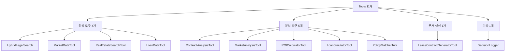

# Tools Reference - 도구 레퍼런스

**버전**: 1.0
**작성일**: 2025-10-14
**총 도구 수**: 11개 (검색 4개 + 분석 5개 + 문서 1개 + 기타 1개)

---

## 📚 목차

- [개요](#-개요)
- [검색 도구 (Search Tools)](#-검색-도구-search-tools)
- [분석 도구 (Analysis Tools)](#-분석-도구-analysis-tools)
- [문서 생성 도구](#-문서-생성-도구)
- [Tool 개발 가이드](#-tool-개발-가이드)
- [Tool 테스트](#-tool-테스트)

---

## 🎯 개요

### Tools란?

Tools는 **단일 기능만 수행하는 순수 함수**입니다. Execution Agents가 실제 작업을 수행하기 위해 호출하는 최하위 레벨 컴포넌트입니다.

```
Execution Agent → Tool → 실제 작업 수행 (DB 조회, API 호출, 계산 등)
```

### Tool 특징

| 특징 | 설명 |
|------|------|
| **단일 책임** | 하나의 명확한 기능만 수행 |
| **순수 함수** | 입력에 대해 예측 가능한 출력 |
| **비동기 지원** | `async/await` 패턴 사용 |
| **표준 인터페이스** | `execute()` 또는 `search()` 메서드 |
| **에러 처리** | 예외 대신 status 코드 반환 |

### Tool 카테고리



---

## 🔍 검색 도구 (Search Tools)

### 1. HybridLegalSearch - 하이브리드 법률 검색

**파일 위치**: [hybrid_legal_search.py](../service_agent/tools/hybrid_legal_search.py)

#### 개요

**계층적 하이브리드 구조**: SQLite (메타데이터) + ChromaDB (벡터 검색)

```
[SQLite]                      [ChromaDB]
- 법령 기본 정보 (laws)        - 시맨틱 벡터 검색
- 조항 상세 (articles)         - 임베딩 모델: KURE_v1
- 법령 간 참조 관계            - 1536차원 벡터
```

#### 주요 기능

```python
class HybridLegalSearch:
    """하이브리드 법률 검색 시스템"""

    # 1. 벡터 검색
    def vector_search(self, query: str, n_results: int = 10) -> Dict

    # 2. 하이브리드 검색 (벡터 + 메타데이터 필터)
    def hybrid_search(
        self,
        query: str,
        limit: int = 10,
        doc_type: Optional[str] = None,           # "법률" | "시행령" | "시행규칙"
        category: Optional[str] = None,            # "부동산" | "세법"
        is_tenant_protection: Optional[bool] = None,  # 임차인 보호 조항 필터
        is_tax_related: Optional[bool] = None      # 세금 관련 조항 필터
    ) -> List[Dict]

    # 3. 특정 조항 검색
    def search_specific_article(
        self,
        law_title: str,        # "주택임대차보호법"
        article_number: str    # "제7조의2"
    ) -> Optional[Dict]
```

#### API 명세

##### `async search(query: str, params: Dict) -> Dict`

**입력**:
```python
params = {
    "mode": "hybrid",  # "hybrid" | "vector" | "specific"
    "limit": 10,
    "doc_type": "법률",
    "is_tenant_protection": True
}
```

**출력**:
```python
{
    "status": "success",
    "data": [
        {
            "law_title": "주택임대차보호법",
            "article_number": "제7조의2",
            "article_title": "전세금 등의 증액 청구 제한",
            "chapter": "제2장 주택임대차보호",
            "section": "제1절 일반규정",
            "content": "임대인은 임대차 존속 중 차임 또는 보증금의 증액을 청구할 수 있으나...",
            "relevance_score": 0.95,
            "is_tenant_protection": true,
            "metadata": {...}
        }
    ],
    "count": 10,
    "query": "전세금 5% 인상",
    "mode": "hybrid"
}
```

#### 사용 예시

```python
# 하이브리드 검색
tool = HybridLegalSearch()

result = await tool.search(
    query="전세금 인상 제한",
    params={
        "mode": "hybrid",
        "limit": 10,
        "is_tenant_protection": True
    }
)

# 특정 조항 검색
result = await tool.search(
    query="주택임대차보호법 제7조의2",
    params={"mode": "specific"}
)
```

#### 데이터 통계

```python
stats = tool.get_law_statistics()
# {
#     "total_laws": 50,
#     "total_articles": 500,
#     "doc_type_distribution": {"법률": 30, "시행령": 15, "시행규칙": 5},
#     "special_articles": {
#         "tenant_protection": 120,
#         "tax_related": 80
#     },
#     "chromadb_documents": 5000
# }
```

---

### 2. MarketDataTool - 부동산 시세 조회

**파일 위치**: [market_data_tool.py](../service_agent/tools/market_data_tool.py)

#### 개요

PostgreSQL 기반 부동산 시세 데이터 제공 (9,738개 매물, 10,772건 거래 내역)

#### 주요 기능

```python
class MarketDataTool:
    """부동산 시세 데이터 Tool (PostgreSQL 연동)"""

    async def search(self, query: str, params: Dict[str, Any] = None) -> Dict[str, Any]
```

#### API 명세

**입력**:
```python
params = {
    "region": "강남구",
    "property_type": "apartment",  # "apartment" | "officetel" | "villa"
    "transaction_type": "sale"     # "sale" | "jeonse" | "rent"
}
```

**출력**:
```python
{
    "status": "success",
    "data": [
        {
            "region": "강남구 역삼동",
            "property_type": "apartment",
            "avg_sale_price": 50000,      # 만원
            "min_sale_price": 30000,
            "max_sale_price": 100000,
            "avg_deposit": 25000,         # 전세 보증금
            "min_deposit": 10000,
            "max_deposit": 50000,
            "avg_monthly_rent": 150,      # 월세
            "transaction_count": 100,
            "unit": "만원"
        }
    ],
    "result_count": 15,
    "metadata": {
        "region": "강남구",
        "property_type": "apartment",
        "data_source": "PostgreSQL"
    }
}
```

#### 사용 예시

```python
tool = MarketDataTool()

# 강남구 아파트 시세 조회
result = await tool.search(
    query="강남구 아파트 시세",
    params={"region": "강남구", "property_type": "apartment"}
)

# 쿼리에서 자동 추출
result = await tool.search(query="서초구 오피스텔 전세 시세", params={})
```

---

### 3. RealEstateSearchTool - 개별 부동산 매물 검색

**파일 위치**: [real_estate_search_tool.py](../service_agent/tools/real_estate_search_tool.py)

#### 개요

PostgreSQL DB에서 개별 매물 정보 조회 (아파트, 오피스텔, 빌라 등)

#### 주요 기능

```python
class RealEstateSearchTool:
    """개별 부동산 매물 검색"""

    async def search(self, query: str, params: Dict[str, Any] = None) -> Dict[str, Any]
```

#### API 명세

**입력**:
```python
params = {
    "region": "강남구",
    "property_type": "APARTMENT",  # "APARTMENT" | "OFFICETEL" | "VILLA"
    "min_price": 300000000,        # 3억
    "max_price": 1000000000,       # 10억
    "min_area": 60.0,              # ㎡
    "max_area": 100.0,
    "include_nearby": True,        # 주변 시설 정보 포함
    "include_transactions": True,   # 실거래가 내역 포함
    "include_agent": False         # 중개사 정보 포함 (조건부)
}
```

**출력**:
```python
{
    "status": "success",
    "data": [
        {
            "property_id": 1234,
            "property_type": "APARTMENT",
            "name": "강남 삼성 푸르지오",
            "address": "서울시 강남구 삼성동 123-45",
            "price": 500000000,
            "area_m2": 84.5,
            "area_py": 25.6,
            "rooms": 3,
            "bathrooms": 2,
            "build_year": 2018,
            "floor": 15,
            "total_floors": 25,
            "elevator": true,
            "parking": true,

            # 주변 시설 (include_nearby=True)
            "nearby_facilities": {
                "subway_stations": [
                    {"name": "삼성역 2호선", "distance": 350}
                ],
                "schools": [
                    {"name": "삼성초등학교", "distance": 500}
                ]
            },

            # 실거래가 내역 (include_transactions=True)
            "transaction_history": [
                {"date": "2024-01", "type": "SALE", "amount": 480000000}
            ],

            # 중개사 정보 (include_agent=True, 조건부)
            "agent_info": {
                "name": "강남부동산",
                "phone": "02-1234-5678"
            }
        }
    ],
    "result_count": 15,
    "metadata": {...}
}
```

#### 사용 예시

```python
tool = RealEstateSearchTool()

# 강남구 아파트 5억 이하 검색
result = await tool.search(
    query="강남구 아파트 5억 이하",
    params={
        "region": "강남구",
        "property_type": "APARTMENT",
        "max_price": 500000000,
        "include_nearby": True
    }
)
```

---

### 4. LoanDataTool - 대출 상품 정보 검색

**파일 위치**: [loan_data_tool.py](../service_agent/tools/loan_data_tool.py)

#### 개요

대출 상품 정보 제공 (주택담보대출, 전세자금대출 등)

#### 주요 기능

```python
class LoanDataTool:
    """대출 상품 정보 검색"""

    async def search(self, query: str, params: Dict[str, Any] = None) -> Dict[str, Any]
```

#### API 명세

**입력**:
```python
params = {
    "loan_type": "housing_loan",  # "housing_loan" | "jeonse_loan" | "mortgage"
    "max_interest_rate": 5.0,
    "min_loan_amount": 100000000
}
```

**출력**:
```python
{
    "status": "success",
    "data": [
        {
            "loan_id": "KB_HOUSING_001",
            "bank_name": "KB국민은행",
            "product_name": "KB 주택담보대출",
            "loan_type": "housing_loan",
            "interest_rate_min": 3.5,
            "interest_rate_max": 5.2,
            "max_ltv": 70,
            "max_dti": 40,
            "max_dsr": 40,
            "max_loan_amount": 500000000,
            "loan_period_max": 30,
            "repayment_methods": ["원금균등", "원리금균등"],
            "eligibility": ["연소득 6,000만원 이상", "정상 신용등급"]
        }
    ],
    "result_count": 10,
    "metadata": {...}
}
```

---

## 📊 분석 도구 (Analysis Tools)

### 1. ContractAnalysisTool - 계약서 조항 분석

**파일 위치**: [contract_analysis_tool.py](../service_agent/tools/contract_analysis_tool.py)

#### 개요

계약서 텍스트를 분석하여 위험요소, 불법조항, 개선사항 추출

#### 주요 기능

```python
class ContractAnalysisTool:
    """계약서 조항 분석 도구"""

    async def execute(
        self,
        contract_text: str,
        contract_type: str = "lease",  # "lease" | "sale"
        legal_references: Optional[List[Dict]] = None
    ) -> Dict[str, Any]
```

#### API 명세

**입력**:
```python
contract_text = """
임대차계약서

임대인: 홍길동
임차인: 김철수

1. 보증금: 5억원
2. 계약기간: 2024년 1월 1일 ~ 2024년 12월 31일 (12개월)
3. 특약사항:
   - 계약기간 중 어떠한 경우에도 중도해지 불가
   - 계약 갱신시 보증금 10% 인상
   - 위약시 보증금의 50%를 위약금으로 지급
"""
```

**출력**:
```python
{
    "status": "success",
    "contract_type": "lease",

    # 구조 분석
    "structure": {
        "has_essential_clauses": {
            "보증금": True,
            "계약기간": True,
            "특약사항": True
        },
        "missing_clauses": ["확정일자", "대항력"],
        "total_clauses": 10
    },

    # 위험 요소
    "risks": [
        {
            "type": "risky_clause",
            "keyword": "어떠한 경우에도",
            "context": "계약기간 중 어떠한 경우에도 중도해지 불가",
            "severity": "high",
            "suggestion": "상호 협의 조항으로 수정을 요청하세요."
        },
        {
            "type": "excessive_penalty",
            "value": "50%",
            "severity": "high",
            "suggestion": "위약금은 통상 계약금의 10% 이내가 적정합니다."
        }
    ],

    # 법적 준수 확인
    "compliance": {
        "is_compliant": False,
        "violations": [
            {
                "law": "주택임대차보호법 제7조",
                "clause": "보증금 증액 제한",
                "detail": "10% 증액은 법정 상한(5%)을 초과합니다."
            }
        ],
        "warnings": [
            {
                "law": "주택임대차보호법 제4조",
                "clause": "최단 임대기간",
                "detail": "12개월 계약은 법정 최단기간(2년) 미만입니다."
            }
        ]
    },

    # 개선 제안
    "recommendations": [
        {
            "category": "compliance",
            "priority": "critical",
            "title": "법률 위반 조항 수정",
            "detail": "10% 증액은 법정 상한(5%)을 초과합니다.",
            "action": "해당 조항을 법률에 맞게 즉시 수정"
        }
    ],

    "confidence": 0.85,
    "timestamp": "2025-10-14T14:30:00Z"
}
```

#### 체크 항목

**필수 조항**:
- 보증금, 월세, 계약기간, 특약사항
- 수리의무, 원상복구, 중도해지, 갱신
- 관리비, 보증보험, 확정일자, 대항력

**위험 키워드**:
- "위약금", "손해배상", "즉시", "포기", "일방적"
- "무조건", "절대", "어떠한 경우에도"
- "책임지지 않", "청구할 수 없", "이의를 제기할 수 없"

---

### 2. MarketAnalysisTool - 시장 동향 분석

**파일 위치**: [market_analysis_tool.py](../service_agent/tools/market_analysis_tool.py)

#### 개요

부동산 시장 데이터 분석 및 가격 적정성 평가

#### 주요 기능

```python
class MarketAnalysisTool:
    """시장 동향 및 가격 적정성 분석"""

    async def execute(
        self,
        property_data: Dict,
        market_data: Dict
    ) -> Dict[str, Any]
```

#### API 명세

**입력**:
```python
property_data = {
    "address": "서울시 강남구",
    "type": "apartment",
    "size": 84.5,  # ㎡
    "price": 500000000
}

market_data = {
    "avg_sale_price": 45000,  # 만원
    "min_sale_price": 30000,
    "max_sale_price": 80000
}
```

**출력**:
```python
{
    "status": "success",

    # 가격 적정성
    "price_assessment": {
        "is_appropriate": True,
        "price_level": "적정",  # "저렴" | "적정" | "고가"
        "compared_to_average": 1.11,  # 평균 대비 111%
        "assessment": "시장 평균보다 약간 높지만 적정 범위 내"
    },

    # 시장 지표
    "metrics": {
        "price_per_m2": 591,  # 만원/㎡
        "avg_price_per_m2": 533,
        "market_percentile": 65  # 시장에서 상위 35%
    },

    # 시장 상황
    "market_conditions": {
        "overall": "활발",
        "supply": "보통",
        "demand": "높음",
        "trend": "상승"
    },

    # 투자 가치
    "investment_value": {
        "grade": "B+",
        "score": 82,
        "factors": [
            "입지 우수",
            "교통 편리",
            "가격 적정"
        ]
    }
}
```

---

### 3. ROICalculatorTool - 투자수익률 계산

**파일 위치**: [roi_calculator_tool.py](../service_agent/tools/roi_calculator_tool.py)

#### 개요

부동산 투자수익률 및 현금흐름 분석

#### 주요 기능

```python
class ROICalculatorTool:
    """투자수익률 계산 및 현금흐름 분석"""

    async def execute(
        self,
        property_price: float,
        monthly_rent: float,
        deposit: float = 0,
        annual_appreciation: float = 3.0,  # 연간 시세 상승률 (%)
        holding_period: int = 5             # 보유 기간 (년)
    ) -> Dict[str, Any]
```

#### API 명세

**입력**:
```python
property_price = 500000000  # 5억
monthly_rent = 2000000      # 200만원
deposit = 50000000          # 5천만원 전세 보증금
```

**출력**:
```python
{
    "status": "success",

    # ROI 지표
    "roi_metrics": {
        "roi_percentage": 8.5,         # 총 수익률 (%)
        "annual_return": 1.7,          # 연평균 수익률 (%)
        "gross_yield": 4.8,            # 임대수익률 (%)
        "net_yield": 3.2,              # 순수익률 (세금/관리비 제외)
        "payback_period": 20.8         # 투자회수기간 (년)
    },

    # 현금흐름
    "cash_flow": {
        "monthly_income": 2000000,     # 월 임대료
        "monthly_expenses": 500000,    # 월 지출 (관리비, 세금 등)
        "monthly_net_income": 1500000, # 월 순수익
        "annual_net_income": 18000000  # 연 순수익
    },

    # 5년 후 예상 수익
    "projection": {
        "future_property_value": 579641000,  # 예상 시세
        "capital_gain": 79641000,            # 시세 차익
        "total_rental_income": 90000000,     # 총 임대료 수입
        "total_expenses": 30000000,          # 총 지출
        "net_profit": 139641000,             # 순이익
        "total_roi": 27.9                    # 총 수익률 (%)
    },

    # 평가
    "evaluation": {
        "grade": "B",
        "score": 75,
        "recommendation": "중간 수준의 투자 가치. 안정적인 임대 수익 가능."
    }
}
```

---

### 4. LoanSimulatorTool - 대출 한도 시뮬레이션

**파일 위치**: [loan_simulator_tool.py](../service_agent/tools/loan_simulator_tool.py)

#### 개요

LTV, DTI, DSR 기반 대출 한도 및 월 상환액 계산

#### 주요 기능

```python
class LoanSimulatorTool:
    """대출 한도 및 금리 시뮬레이션 (LTV, DTI, DSR)"""

    async def execute(
        self,
        property_price: float,
        annual_income: float,
        existing_debt_monthly: float = 0,
        interest_rate: float = 4.5,
        loan_period: int = 30
    ) -> Dict[str, Any]
```

#### API 명세

**입력**:
```python
property_price = 500000000    # 5억
annual_income = 100000000     # 연소득 1억
existing_debt_monthly = 500000  # 기존 부채 월 50만원
interest_rate = 4.5           # 금리 4.5%
loan_period = 30              # 대출 기간 30년
```

**출력**:
```python
{
    "status": "success",

    # 최대 대출 한도
    "max_loan": {
        "loan_amount": 350000000,  # 3.5억 (LTV 70% 기준)
        "ltv_ratio": 70,           # LTV 70%
        "dti_limit": 400000000,    # DTI 기준 한도 4억
        "dsr_limit": 380000000,    # DSR 기준 한도 3.8억
        "limiting_factor": "LTV"   # 제약 요소
    },

    # 상환 계획
    "repayment_plan": {
        "monthly_payment": 1773596,      # 월 상환액
        "principal_payment": 461930,     # 원금
        "interest_payment": 1311666,     # 이자
        "total_payment": 638494560,      # 총 상환액
        "total_interest": 288494560,     # 총 이자
        "payment_burden_pct": 21.7       # 소득 대비 부담률 (%)
    },

    # 비율 분석
    "ratios": {
        "ltv": 70.0,  # 담보인정비율
        "dti": 21.7,  # 총부채상환비율
        "dsr": 27.3   # 총부채원리금상환비율
    },

    # 대출 가능 여부
    "eligibility": {
        "is_eligible": True,
        "issues": [],
        "warnings": ["DSR이 25%를 초과합니다. 대출 심사에 영향을 줄 수 있습니다."]
    }
}
```

---

### 5. PolicyMatcherTool - 정부 지원 정책 매칭

**파일 위치**: [policy_matcher_tool.py](../service_agent/tools/policy_matcher_tool.py)

#### 개요

사용자 프로필에 맞는 정부 지원 정책 추천

#### 주요 기능

```python
class PolicyMatcherTool:
    """정부 지원 정책 매칭 및 혜택 분석"""

    async def execute(
        self,
        user_profile: Dict
    ) -> Dict[str, Any]
```

#### API 명세

**입력**:
```python
user_profile = {
    "age": 28,
    "annual_income": 60000000,
    "has_house": False,
    "marriage_years": 2,  # 신혼부부
    "region": "서울"
}
```

**출력**:
```python
{
    "status": "success",

    # 매칭된 정책
    "matched_policies": [
        {
            "policy_id": "YOUTH_LOAN_001",
            "name": "청년 주택드림 청약통장",
            "category": "청년 지원",
            "description": "만 19~34세 무주택 청년 대상 우대금리 제공",
            "benefits": {
                "interest_rate": 2.3,
                "max_loan_amount": 300000000,
                "special_benefits": ["우대금리 1.2%p", "청약 가점 우대"]
            },
            "eligibility": {
                "age": "만 19~34세",
                "income": "연 7천만원 이하",
                "housing": "무주택"
            },
            "match_score": 95,
            "is_eligible": True,
            "priority_reason": "나이, 소득, 무주택 요건 모두 충족"
        },
        {
            "policy_id": "NEWLYWED_001",
            "name": "신혼부부 전용 대출",
            "category": "신혼부부 지원",
            "benefits": {
                "interest_rate": 1.85,
                "max_loan_amount": 400000000
            },
            "match_score": 88,
            "is_eligible": True
        }
    ],

    # 혜택 요약
    "benefit_summary": {
        "total_policies": 2,
        "max_loan_amount": 400000000,
        "min_interest_rate": 1.85,
        "estimated_savings": 15000000  # 5년간 예상 절감액
    },

    # 신청 방법
    "application_guide": {
        "required_documents": [
            "주민등록등본",
            "소득증빙서류",
            "혼인관계증명서"
        ],
        "application_url": "https://www.hf.go.kr"
    }
}
```

---

## 📝 문서 생성 도구

### LeaseContractGeneratorTool - 임대차 계약서 생성

**파일 위치**: [lease_contract_generator_tool.py](../service_agent/tools/lease_contract_generator_tool.py)

#### 개요

주택임대차 표준계약서 자동 생성

#### 주요 기능

```python
class LeaseContractGeneratorTool:
    """주택임대차 계약서 생성"""

    async def execute(
        self,
        lessor_name: str,
        lessee_name: str,
        address: str,
        deposit: str,
        monthly_rent: str = "0",
        start_date: str,
        end_date: str,
        special_terms: List[str] = None
    ) -> Dict[str, Any]
```

#### API 명세

**입력**:
```python
lessor_name = "홍길동"
lessee_name = "김철수"
address = "서울시 강남구 역삼동 123-45 아파트 101동 1001호"
deposit = "5억원"
monthly_rent = "0원"
start_date = "2024년 1월 1일"
end_date = "2025년 12월 31일"
special_terms = [
    "계약 기간 중 임차인은 전입신고 및 확정일자를 받을 것",
    "관리비는 매월 말일 납부"
]
```

**출력**:
```python
{
    "status": "success",
    "title": "주택임대차 표준계약서",

    # 문서 섹션
    "sections": [
        {
            "title": "제1조 (목적물)",
            "content": "임대인은 아래 표시 부동산을 임차인에게 임대하고..."
        },
        {
            "title": "제2조 (계약 내용)",
            "content": "1. 보증금: 5억원\n2. 월세: 0원\n3. 계약기간: 2024년 1월 1일 ~ 2025년 12월 31일"
        },
        {
            "title": "특약사항",
            "content": "1. 계약 기간 중 임차인은 전입신고 및 확정일자를 받을 것\n2. 관리비는 매월 말일 납부"
        }
    ],

    # 메타데이터
    "metadata": {
        "generated_at": "2025-10-14T14:30:00Z",
        "template_version": "2024_standard",
        "law_basis": "주택임대차보호법"
    },

    # 전체 텍스트 (Markdown)
    "content": "# 주택임대차 표준계약서\n\n임대인과 임차인은..."
}
```

---

## 🔧 Tool 개발 가이드

### Tool 인터페이스 규칙

#### 1. 비동기 메서드

```python
async def execute(self, **kwargs) -> Dict[str, Any]:
    """Tool 실행 메서드 (비동기)"""
    pass

async def search(self, query: str, params: Dict = None) -> Dict[str, Any]:
    """검색 Tool용 메서드"""
    pass
```

#### 2. 표준 응답 형식

```python
# 성공
{
    "status": "success",
    "data": [...],         # 결과 데이터
    "metadata": {...}      # 메타데이터
}

# 실패
{
    "status": "error",
    "error": "Error message",
    "error_type": "validation_error"  # Optional
}
```

### 새로운 Tool 추가

#### 1. Tool 클래스 생성

```python
# backend/app/service_agent/tools/my_tool.py

import logging
from typing import Dict, Any, Optional

logger = logging.getLogger(__name__)


class MyTool:
    """나의 새로운 Tool"""

    def __init__(self):
        self.name = "my_tool"
        logger.info("MyTool initialized")

    async def execute(self, param1: str, param2: int = 0) -> Dict[str, Any]:
        """
        Tool 실행

        Args:
            param1: 파라미터 1
            param2: 파라미터 2 (선택적)

        Returns:
            실행 결과
        """
        try:
            # 1. 입력 검증
            if not param1:
                return {
                    "status": "error",
                    "error": "param1 is required"
                }

            # 2. 실제 작업 수행
            result = self._do_work(param1, param2)

            # 3. 성공 응답
            return {
                "status": "success",
                "data": result,
                "metadata": {
                    "param1": param1,
                    "param2": param2
                }
            }

        except Exception as e:
            logger.error(f"MyTool execution failed: {e}")
            return {
                "status": "error",
                "error": str(e)
            }

    def _do_work(self, param1: str, param2: int) -> Dict:
        """실제 작업 수행 (private)"""
        # 구현
        return {"result": "success"}
```

#### 2. Execution Agent에 통합

```python
# analysis_executor.py

class AnalysisExecutor:
    def __init__(self, llm_context=None):
        # 기존 도구들...
        self.contract_tool = ContractAnalysisTool()
        self.market_tool = MarketAnalysisTool()

        # 새로운 도구 추가
        from app.service_agent.tools.my_tool import MyTool
        self.my_tool = MyTool()

    def _get_available_analysis_tools(self) -> Dict[str, Any]:
        """사용 가능한 도구 정보"""
        tools = {}

        # 기존 도구들...

        # 새 도구 추가
        if self.my_tool:
            tools["my_tool"] = {
                "name": "my_tool",
                "description": "나의 새로운 Tool",
                "capabilities": ["기능1", "기능2"],
                "available": True
            }

        return tools

    async def analyze_data_node(self, state: AnalysisTeamState):
        # Tool 선택 로직...

        # 새 도구 실행
        if "my_tool" in selected_tools:
            try:
                results["my_tool"] = await self.my_tool.execute(
                    param1="test",
                    param2=123
                )
            except Exception as e:
                logger.error(f"MyTool execution failed: {e}")
```

---

## 🧪 Tool 테스트

### 단위 테스트

```python
# tests/test_my_tool.py

import pytest
from app.service_agent.tools.my_tool import MyTool


@pytest.mark.asyncio
async def test_my_tool_success():
    """MyTool 정상 실행 테스트"""
    tool = MyTool()

    result = await tool.execute(param1="test", param2=123)

    assert result["status"] == "success"
    assert "data" in result
    assert result["data"]["result"] == "success"


@pytest.mark.asyncio
async def test_my_tool_validation_error():
    """MyTool 검증 실패 테스트"""
    tool = MyTool()

    result = await tool.execute(param1="", param2=0)

    assert result["status"] == "error"
    assert "param1 is required" in result["error"]


@pytest.mark.asyncio
async def test_my_tool_exception_handling():
    """MyTool 예외 처리 테스트"""
    tool = MyTool()

    # _do_work에서 예외 발생하도록 Mock
    tool._do_work = lambda x, y: 1 / 0

    result = await tool.execute(param1="test", param2=123)

    assert result["status"] == "error"
    assert "error" in result
```

### 통합 테스트

```python
# tests/test_executor_with_my_tool.py

import pytest
from app.service_agent.execution_agents.analysis_executor import AnalysisExecutor
from app.service_agent.foundation.separated_states import StateManager


@pytest.mark.asyncio
async def test_analysis_executor_with_my_tool():
    """AnalysisExecutor + MyTool 통합 테스트"""
    executor = AnalysisExecutor()

    # 공유 상태 생성
    shared_state = StateManager.create_shared_state(
        query="테스트 쿼리",
        session_id="test_session"
    )

    # 실행
    result = await executor.execute(
        shared_state=shared_state,
        analysis_type="comprehensive"
    )

    # 검증
    assert result["status"] == "completed"
    assert "raw_analysis" in result
    assert "my_tool" in result["raw_analysis"]
```

---

## 📚 참고 자료

### 관련 문서

- [EXECUTION_AGENTS_GUIDE.md](EXECUTION_AGENTS_GUIDE.md) - Execution Agents 상세 가이드
- [SYSTEM_FLOW_DIAGRAM.md](SYSTEM_FLOW_DIAGRAM.md) - LLM 호출 지점
- [ARCHITECTURE_OVERVIEW.md](ARCHITECTURE_OVERVIEW.md) - 전체 아키텍처

### 코드 위치

| 카테고리 | 파일 경로 |
|---------|----------|
| 검색 도구 | [backend/app/service_agent/tools/](../service_agent/tools/) |
| 분석 도구 | [backend/app/service_agent/tools/analysis_tools.py](../service_agent/tools/analysis_tools.py) |
| 문서 생성 | [backend/app/service_agent/tools/lease_contract_generator_tool.py](../service_agent/tools/lease_contract_generator_tool.py) |

---

**생성일**: 2025-10-14
**버전**: 1.0
**총 도구 수**: 11개
**상태**: ✅ 프로덕션 준비 완료
