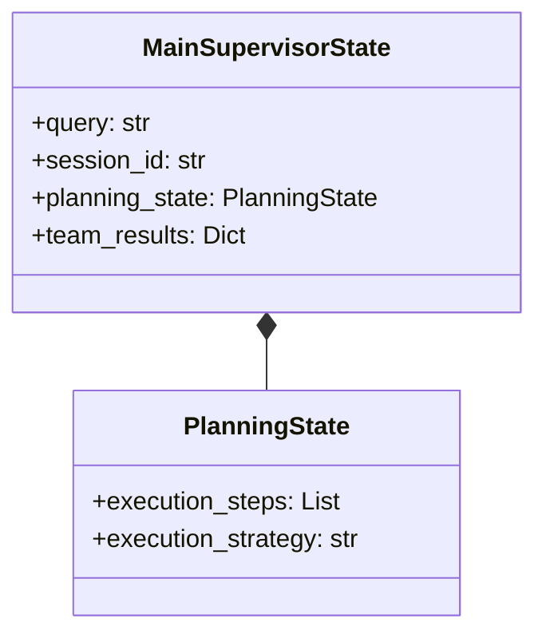
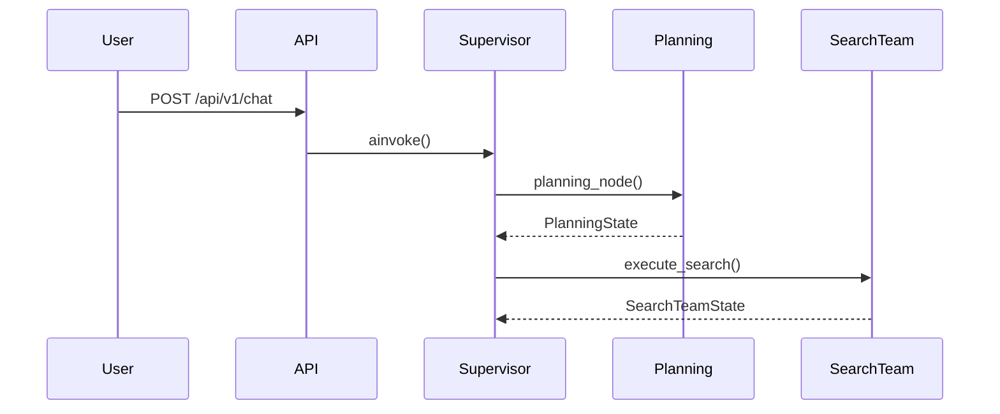
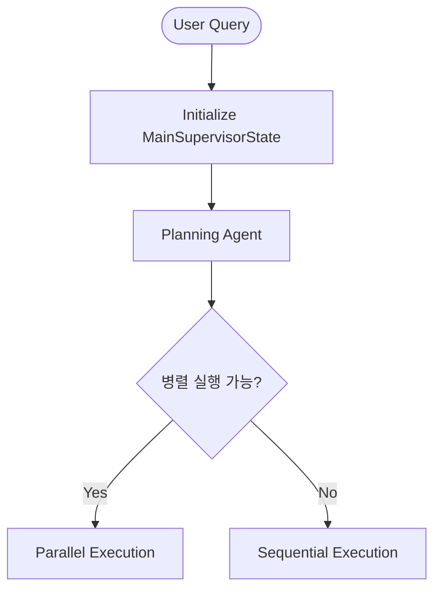

# HolmesNyangz State Management Diagrams

**Date**: 2025-10-15
**Author**: Claude Code
**Purpose**: State 구조 및 흐름 시각화 (협업용)

---

## 📋 Table of Contents

1. [개요](#개요)
2. [다이어그램 목록](#다이어그램-목록)
3. [다이어그램 보는 방법](#다이어그램-보는-방법)
4. [각 다이어그램 설명](#각-다이어그램-설명)
5. [업데이트 가이드](#업데이트-가이드)
6. [협업 활용 방법](#협업-활용-방법)

---

## 개요

HolmesNyangz는 **Multi-Agent Team-based Architecture**를 사용하며, 복잡한 State 관리 구조를 가지고 있습니다.

이 디렉토리의 다이어그램들은 다음을 시각화합니다:
- **State 구조**: 어떤 State들이 있고, 어떻게 연결되어 있는가?
- **State 생명 주기**: State가 어떻게 생성되고, 업데이트되고, 완료되는가?
- **State 흐름**: 실행 중에 State가 어떻게 전환되고 이동하는가?

---

## 다이어그램 목록

### 1. `state_structure.mmd` - Class Diagram ⭐⭐⭐⭐⭐
**타입**: Mermaid Class Diagram
**목적**: State 계층 구조와 관계 시각화

**내용**:
- MainSupervisorState (최상위)
- PlanningState, SharedState
- SearchTeamState, DocumentTeamState, AnalysisTeamState
- 보조 타입들 (SearchKeywords, DocumentTemplate, AnalysisMetrics 등)
- StateManager, StateValidator, StateTransition 유틸리티

**언제 보는가**:
- State 구조를 처음 이해할 때
- 새로운 팀 State 추가 시
- State 필드 참조가 필요할 때

---

### 2. `state_lifecycle.mmd` - Sequence Diagram ⭐⭐⭐⭐⭐
**타입**: Mermaid Sequence Diagram
**목적**: State의 생성 → 실행 → 완료 전체 흐름

**내용**:
- User → API → Supervisor → Teams 흐름
- 각 단계별 State 변경 과정
- StateManager의 역할
- WebSocket 실시간 업데이트

**언제 보는가**:
- 전체 실행 흐름을 이해할 때
- 디버깅 시 어느 단계에서 문제인지 파악
- 새로운 팀 통합 시 흐름 이해

---

### 3. `state_flow.mmd` - Flowchart ⭐⭐⭐⭐⭐
**타입**: Mermaid Flowchart
**목적**: State 전환 흐름과 조건 분기

**내용**:
- 초기화 → Planning → Team Execution → Aggregation → Response
- 병렬 실행 vs 순차 실행
- 조건 분기 (필요한 팀 선택)
- 에러 처리 경로

**언제 보는가**:
- 조건부 실행 로직 이해
- 병렬 실행 그룹 설계
- 에러 복구 전략 수립

---

## 다이어그램 보는 방법

### 방법 1: GitHub에서 보기 ⭐⭐⭐⭐⭐ (추천)

GitHub은 Mermaid 다이어그램을 자동으로 렌더링합니다.

1. GitHub 레포지토리에서 `.mmd` 파일 클릭
2. 자동으로 다이어그램 렌더링됨
3. 추가 도구 불필요

**장점**:
- 별도 설치 불필요
- 팀원 누구나 즉시 확인 가능
- 버전 히스토리 추적 가능

---

### 방법 2: VS Code에서 보기 ⭐⭐⭐⭐⭐ (개발 시 추천)

**필요한 Extension**:
- [Markdown Preview Mermaid Support](https://marketplace.visualstudio.com/items?itemName=bierner.markdown-mermaid)
- 또는 [Mermaid Editor](https://marketplace.visualstudio.com/items?itemName=tomoyukim.vscode-mermaid-editor)

**사용 방법**:
1. VS Code에서 `.mmd` 파일 열기
2. `Ctrl+Shift+V` (Preview) 또는 `Ctrl+K V` (Side by Side)
3. 실시간 렌더링 확인

**장점**:
- 코드와 다이어그램 동시 확인
- 수정 즉시 반영
- 개발 환경 내 통합

---

### 방법 3: Mermaid Live Editor ⭐⭐⭐⭐ (온라인)

**URL**: https://mermaid.live/

**사용 방법**:
1. `.mmd` 파일 내용 전체 복사
2. Mermaid Live Editor에 붙여넣기
3. 실시간 렌더링 확인
4. PNG/SVG 다운로드 가능

**장점**:
- 설치 불필요
- 공유 링크 생성 가능
- 이미지 다운로드 가능

---

### 방법 4: IntelliJ IDEA / PyCharm ⭐⭐⭐

**필요한 Plugin**:
- [Mermaid](https://plugins.jetbrains.com/plugin/20146-mermaid)

**사용 방법**:
1. Plugin 설치
2. `.mmd` 파일 열기
3. Preview 탭에서 다이어그램 확인

---

## 각 다이어그램 설명

### 1. State Structure (Class Diagram)



**주요 관계**:
- `*--` (Composition): 강한 포함 관계
- `o--` (Aggregation): 약한 참조 관계
- `..>` (Dependency): 사용 관계

**색상 의미** (다이어그램 내):
- 파란색: 핵심 State
- 초록색: Search Team 관련
- 주황색: Document Team 관련
- 분홍색: Analysis Team 관련

---

### 2. State Lifecycle (Sequence Diagram)



**주요 단계**:
1. **Phase 1**: 초기화 및 Planning (파란색)
2. **Phase 2**: Search Team 실행 (초록색)
3. **Phase 3**: Document Team 실행 (주황색, 조건부)
4. **Phase 4**: Analysis Team 실행 (분홍색)
5. **Phase 5**: 최종 응답 생성 (보라색)
6. **Phase 6**: Memory 저장 및 응답 (회색)

**WebSocket 브로드캐스트**:
- 각 단계마다 실시간 TODO 업데이트
- Frontend에 진행 상황 전송

---

### 3. State Flow (Flowchart)



**색상 코드**:
- 🔵 파란색: 초기화 단계
- 🟣 보라색: Planning 단계
- 🟢 초록색: Search Team
- 🟠 주황색: Document Team
- 🔴 분홍색: Analysis Team
- 🟡 노란색: WebSocket 브로드캐스트
- ⚪ 회색: 최종 응답 및 Memory 저장
- 🔴 빨간색: 에러 처리

**주요 분기점**:
- `병렬 실행 가능?`: parallel_groups 확인
- `Legal Search 필요?`: 도구 선택 결과
- `Risk Level`: Document Review 결과
- `모든 팀 완료?`: completed_teams vs active_teams

---

## 업데이트 가이드

### State 구조 변경 시

1. **코드 수정**:
   - `backend/app/service_agent/foundation/separated_states.py` 수정

2. **다이어그램 업데이트**:
   - `state_structure.mmd` 업데이트 (클래스 필드 추가/수정)
   - Git commit에 다이어그램 업데이트 포함

3. **검증**:
   - GitHub에서 다이어그램 렌더링 확인
   - VS Code Preview로 문법 오류 체크

---

### 새로운 팀 추가 시

1. **state_structure.mmd**:
   - 새로운 TeamState 클래스 추가
   - MainSupervisorState와 관계 연결
   - 보조 타입 추가 (필요 시)

2. **state_lifecycle.mmd**:
   - 새로운 팀 실행 Phase 추가
   - StateManager 병합 단계 추가

3. **state_flow.mmd**:
   - 새로운 팀 실행 플로우 추가
   - 조건 분기 업데이트
   - 색상 클래스 추가

**예시 (Consulting Team 추가 시)**:
```mermaid
class ConsultingTeamState {
    +team_name: str
    +status: str
    +shared_context: Dict
    +consultation_type: str
    +expert_opinions: List
    +recommendations: List
}

MainSupervisorState o-- ConsultingTeamState : references
```

---

### 실행 흐름 변경 시

1. **state_lifecycle.mmd**:
   - Sequence Diagram에서 순서 변경
   - 새로운 Phase 추가

2. **state_flow.mmd**:
   - Flowchart에서 분기 조건 수정
   - 새로운 노드 추가

**주의사항**:
- MainSupervisorState → Planning → Teams 순서는 유지
- StateManager 호출 위치 명확히 표시
- WebSocket 브로드캐스트 타이밍 표시

---

## 협업 활용 방법

### 1. 신규 팀원 온보딩

**추천 순서**:
1. `state_structure.mmd` 먼저 보기 (전체 구조 이해)
2. `STATE_MANAGEMENT_GUIDE.md` 읽기 (개념 이해)
3. `state_lifecycle.mmd` 보기 (실행 흐름 이해)
4. `state_flow.mmd` 보기 (조건 분기 이해)
5. `separated_states.py` 코드 읽기 (구현 이해)

**예상 소요 시간**: 30-60분

---

### 2. 기능 설계 회의

**다이어그램 활용**:
- 새로운 팀 추가 시 → `state_structure.mmd`에 스케치
- 실행 흐름 변경 시 → `state_lifecycle.mmd`에 표시
- 조건 분기 추가 시 → `state_flow.mmd`에 그리기

**회의록에 포함**:
- 수정된 다이어그램 스크린샷
- 변경 사항 설명
- 예상되는 영향 범위

---

### 3. 코드 리뷰

**다이어그램 참조**:
- State 구조 변경 PR → `state_structure.mmd` 링크 첨부
- 실행 흐름 변경 PR → `state_lifecycle.mmd` 링크 첨부
- 조건 분기 변경 PR → `state_flow.mmd` 링크 첨부

**리뷰 체크리스트**:
- [ ] State 구조 변경이 다이어그램에 반영되었는가?
- [ ] 실행 흐름 변경이 다이어그램에 반영되었는가?
- [ ] 새로운 조건 분기가 다이어그램에 표시되었는가?

---

### 4. 디버깅

**시나리오**: "Search Team에서 결과가 안 나와요"

**디버깅 순서**:
1. `state_lifecycle.mmd` 보기 → Search Team Phase 확인
2. `state_flow.mmd` 보기 → Search Team 내부 흐름 확인
3. 각 노드에서 State 로그 확인
4. 문제 지점 특정

**로그 확인 포인트**:
- `SearchTeamState.status` 변화
- `SearchTeamState.error` 내용
- `MainSupervisorState.completed_teams`에 "search" 포함 여부

---

### 5. 문서화

**다이어그램 임베딩**:

Markdown 파일에서 다이어그램 링크:
```markdown
## State 구조

전체 구조는 [State Structure Diagram](./diagrams/state_structure.mmd)을 참조하세요.

### 실행 흐름

1. 사용자 쿼리 → MainSupervisor 초기화
2. Planning Agent 실행 ([Lifecycle Diagram](./diagrams/state_lifecycle.mmd) Phase 1)
3. 팀 실행 ([Flow Diagram](./diagrams/state_flow.mmd) 참조)
```

**GitHub Pages / Wiki**:
- Mermaid 다이어그램을 PNG/SVG로 변환하여 삽입
- Mermaid Live Editor에서 다운로드 가능

---

## 관련 문서

### 코드 파일
- [`separated_states.py`](../../service_agent/foundation/separated_states.py) - State 정의 코드
- [`team_based_supervisor.py`](../../service_agent/supervisors/team_based_supervisor.py) - Supervisor 구현
- [`search_executor.py`](../../service_agent/execution_agents/search_executor.py) - Search Team 구현

### 문서 파일
- [`STATE_MANAGEMENT_GUIDE.md`](../STATE_MANAGEMENT_GUIDE.md) - State 관리 가이드
- [`PHASE1_MANUAL.md`](../PHASE1_MANUAL.md) - Phase 1 매뉴얼
- [`dbdiagram_schema.dbml`](../../../migrations/dbdiagram_schema.dbml) - 데이터베이스 스키마

---

## FAQ

### Q1: Mermaid 문법을 배우려면?
**A**: [Mermaid 공식 문서](https://mermaid.js.org/) 참조

### Q2: 다이어그램이 너무 복잡해서 안 보여요
**A**:
- Mermaid Live Editor에서 Zoom In/Out 사용
- 일부만 복사하여 별도로 확인
- VS Code에서 전체 화면으로 보기

### Q3: 다이어그램 수정 시 충돌이 자주 발생해요
**A**:
- Branch 전략 사용 (feature branch에서 작업)
- 다이어그램은 텍스트 파일이므로 merge 가능
- 충돌 시 `<<<<<<` 마커 제거 후 수동 병합

### Q4: PNG/SVG로 변환하려면?
**A**:
1. Mermaid Live Editor 사용 (https://mermaid.live/)
2. 다이어그램 코드 붙여넣기
3. 우측 상단 "Actions" → "Download PNG" 또는 "Download SVG"

### Q5: 다이어그램이 GitHub에서 안 보여요
**A**:
- `.mmd` 파일 확장자 확인
- Markdown 파일에 임베드 시: ` ```mermaid ... ``` ` 사용
- GitHub가 Mermaid를 지원하는지 확인 (2022년부터 지원)

---

## 버전 히스토리

| 버전 | 날짜 | 변경 사항 | 작성자 |
|------|------|-----------|--------|
| 1.0.0 | 2025-10-15 | 초기 생성 (3개 다이어그램) | Claude Code |

---

## 라이선스

이 다이어그램들은 HolmesNyangz 프로젝트의 일부입니다.

---

**마지막 업데이트**: 2025-10-15
**다음 리뷰 예정**: State 구조 변경 시 (수시)
